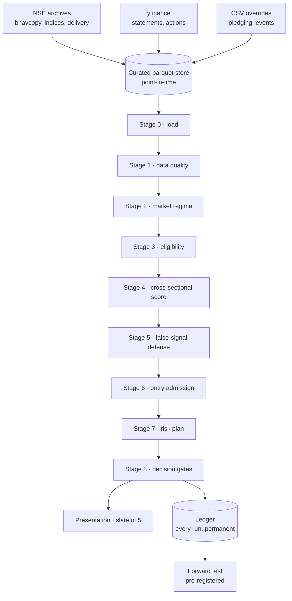

# ProSignal

A cross-sectional equity ranking engine for NSE cash equities. It reads
point-in-time market data, fits a linear factor model to forward returns,
ranks the eligible universe, and puts five names on a screen with the
arithmetic that produced them.

It issues opinions. It has no order-routing code and no broker connection.

---

## Executive summary

| | |
|---|---|
| **Market** | India, NSE cash equities |
| **Universe** | ~750 names, liquidity-screened point-in-time |
| **Frequency** | Once per trading session, end-of-day |
| **Horizon** | 63 sessions (~3 months) |
| **Method** | Ridge regression on the cross-sectional factors that clear a coverage floor — **12 of 17** on the current feed — refit each run |
| **Output** | A ranked shortlist of 5, each with factor contributions |
| **Execution** | None. No orders, no broker, no automation |
| **Status** | Forward test registered, not yet started |

> [!IMPORTANT]
> **The validation figures below are withdrawn pending a re-run.** They were
> computed on a training panel built from ONE universe — the names the
> liquidity screen admits on the most recent session, projected backwards over
> every training date. Measured against the screen resolved properly per date,
> **13–28% of the names eligible on each historical date are absent from that
> set**, excluded for what happened afterwards, while names eligible today
> contributed rows on dates they could not have been traded on.
>
> The panel is now point-in-time (`crosssec.liquidity_mask`). Refitting on the
> corrected panel moves the model in the shape survivorship predicts:
>
> | factor | biased panel | point-in-time | |
> |---|---|---|---|
> | `amihud` (illiquidity) | +0.00737 | −0.00917 | **sign flip** |
> | `beta_120` | +0.00298 | −0.00274 | **sign flip** |
> | `mom_6_1` | +0.01389 | +0.00288 | −79% |
>
> Illiquidity and beta look rewarded when only the survivors are kept, because
> the risky illiquid names that did not make it are missing. **Every number in
> this section needs recomputing before it can be quoted again.**

**The central finding as last measured — on the biased panel, and therefore
not currently standing:** on the holdout, the top decile returned **+4.35% per
63-session period** at an overlap-corrected **t = 3.13**. Regressed against six
long-short factors built from the engine's own definitions, that excess had an
**R² of 0.730** and an **alpha of −1.01% at t = −0.38**.

That the incremental alpha was **not** demonstrated is the one conclusion the
correction does not threaten — it was already negative.

---

## What ProSignal is

A **research instrument**. It ranks stocks by predicted 63-session forward
return using a ridge model over factors drawn from published literature, and
shows the reader the z-score, fitted coefficient and contribution behind each
name.

It is **rule-based and statistical**, not machine-learned in any modern sense.
The model is a penalised linear regression with a fixed penalty
(`alpha = 20000`). There is no neural network, no gradient boosting, no
reinforcement learning, and no language model anywhere in the signal path.

It runs **once per session on closing data**. There is no intraday component.

Its intended user is someone who can read a factor loading and knows what an
information coefficient is.

## What ProSignal is not

- **Not an autonomous trading system.** There is no order-placement code in
  this repository. The Upstox trading endpoints were reviewed and deliberately
  not wired.
- **Not a broker or portfolio manager.** Position sizing is computed and
  displayed; nothing acts on it.
- **Not AI-powered.** An AI agent was used to build and audit it. That is a
  fact about the development process, not about the engine.
- **Not a probability oracle.** The score is a rank within the day's eligible
  universe. See [Calibration](#calibration).
- **Not high-frequency.** The label is three months long.
- **Not validated as profitable.** See
  [What has not been established](#what-has-not-been-established).
- **Not investment advice.** It is a decision-support tool.

---

## Core philosophy

**Refuse rather than guess.** Where the engine cannot compute something
honestly, it says so and drops the component rather than substituting a
plausible number. The Stage 3 pledging gate reports `NOT_TESTABLE` — it does
not pass. A run whose ranking model could not fit is labelled as unscored on
the card.

**Cross-sectional, not absolute.** Every reading is relative to the same day's
universe. A momentum z-score of +1.5 means "high versus the market today", not
"high versus 2019". This removes the need for regime-dependent thresholds.

**The bar is stated before the test.** `validation.significance.t_stat_bar` is
3.0, following Harvey, Liu & Zhu (2016). It sits in the config, not in a
conclusion written afterwards.

**Negative results are kept.** Where research showed a component did not work,
it was removed and the finding recorded. See
[Research evolution](#research-evolution).

**Purge before you measure.** The label is 63 sessions; the purge is 63
sessions. It was 21 once, which left 42 sessions of every training row's label
window inside the test block. That leak flattered everything computed through
it and the loader now enforces `purge >= horizon`.

---

## System architecture



The stage names above are `STAGE_LABELS` in `pipeline.py` and the modules are
`src/prosignal/stages/stage1_*.py` … `stage8_*.py`.

---

## Data sources and lineage

| Source | Provides | Consumed by | Cadence | Caveats |
|---|---|---|---|---|
| **NSE archives** (`nse_archives.py`) | Daily bhavcopy OHLCV, index closes, delivery quantities, corporate actions, board meetings, equity master | Prices, indices, delivery, universe | Daily, EOD | **403s before 2016-01.** Delivery not re-servable before ~2021. Blocks datacentre IPs — an Indian host is materially safer |
| **yfinance** (`yfinance_provider.py`) | Income statement, balance sheet, cash flow; corporate actions as fallback | Valuation factors | Refreshed on a session cadence | **Period-end labels, no filing dates.** Bulk share-count coverage begins 2023-06. Availability is derived from the SEBI LODR deadline instead |
| **NSE Ind-AS** (`nse_fundamentals.py`) | Quarterly filings with true filing dates, 186 names | Legacy Stage 4 value/quality | **Defunct — stopped 2025-03-11** | 528 days stale; every symbol exceeds `max_fundamental_age_days`. These factors are dropped from every live run |
| **CSV overrides** (`csv_import.py`) | Promoter pledging, regulatory events, manual corporate actions | Stage 3 gates | Manual | **Pledging file is empty.** The gate reports NOT_TESTABLE |

### Lineage example — `deliv_pct`

```
NSE sec_bhavdata (delivery qty, traded qty)
  → store.write_delivery() → curated/delivery/year=YYYY.parquet
  → build_panel(delivery=…) → 60-session mean of delivered fraction
  → cross-sectional rank → deliv_pct_r
  → ridge coefficient +0.0235
  → contribution = z × coefficient
  → "Share of trading taken to delivery" under Participation
```

Delivered fraction is India-specific: NSE publishes how much of each day's
volume settled by delivery rather than being squared off intraday. It carries
the largest coefficient in the fit.

### Failure behaviour

Feeds are **required** or **optional** per `config/parameters.yaml` → `feeds`.
A missing required feed fails the run. A stale one is marked `STALE` in the
manifest with its age in sessions. An empty delivery panel raises rather than
defaulting to neutral — measured, treating it as neutral replaced a third of
the top decile and cost 18% of the IC while the run reported nothing.

Raw HTTP payloads are cached under `data/cache/` and LRU-evicted to 384 MB
after every ingest.

---

## Universe

Resolved **point-in-time** by `UniverseResolver.resolve_liquidity_pit()`:

| Filter | Value |
|---|---|
| Minimum ADTV | ₹5 crore over a trailing window |
| Minimum price | ₹20 |
| Minimum history | 300 sessions |
| Maximum names | 750 |

It is **not** a static NIFTY 200 list. The index snapshot is stored for
breadth and benchmark purposes; the tradable universe is rebuilt from
liquidity as it stood on each date.

**Survivorship.** The measured disappearance rate is **4.3%/year**. The
decision universe is rebuilt per date from stored data rather than from today's
listings, so a name that delisted in 2021 is present in 2020's universe.

The **training panel** did not do this until recently: it was built from the
screen resolved once, on the latest session. `crosssec.liquidity_mask` now
applies the same screen per date to the panel and to the equal-weight benchmark
that beta and residual momentum are measured against. It agrees with
`UniverseResolver.resolve_liquidity_pit` on about **88%** of names; the
remainder is window handling at the edges, and it is stated rather than implied.

The disappearance rate is also
the main reason history cannot be extended: vendors serving candles back to
2000 carry only currently-listed instruments, and a 26-year reconstruction
would be missing **68%** of the companies that actually traded.

---

## Time horizon

| Horizon | Value | Note |
|---|---|---|
| Label / model | 63 sessions | `forward_return_sessions` |
| Panel step | 21 sessions | Observations overlap 3:1 — see [Statistical validation](#statistical-validation) |
| Expected hold | 15–63 sessions | Reported per name |
| Purge | 63 sessions | Must equal or exceed the label |
| Embargo | 21 sessions | On top of the purge |
| Holdout | 378 sessions | Sacred; 2025-02-07 onward |

63 was chosen from a horizon surface, not tuned. It sits on a **plateau**
(21–84 sessions, 11.20–11.65% annualised net) rather than at a peak. H=84 buys
+0.06 Sharpe and costs 0.41pp of return, which is inside the CPCV noise band
(sd 0.83).

---

## Signal engine

### Stage 1 — Data quality

**Objective.** Reject names whose price history cannot be trusted.

**Rules.** Cross-source agreement against yfinance on the latest close; scan
of **260 sessions** for unexplained discontinuities; corporate-action
reconciliation.

**Output.** ~40 of 750 names excluded on a typical run.

**Rationale.** An unadjusted 1:10 split reads as a −90% session and corrupts
every lookback feature that spans it. The scan window covers the model's
longest feature lookback (253 sessions for `prox_52w` and `resid_mom`).

**Failure mode.** A corporate action published after the ex-date is invisible
until the next actions refresh. The 260-session scan bounds the exposure — the
name is rejected rather than mis-scored.

`stages/stage1_data_quality.py`

### Stage 2 — Market regime

**Objective.** Establish whether conditions resemble those the strategy needs.

**Calculation.** Two measures that must agree:

```
trend  = annualised slope of a 63-session OLS on log(NIFTY 200)
         AND close > 200-session SMA
vol    = India VIX percentile over trailing 252 sessions,
         split at the 33rd and 67th
```

**Rules.** Uptrend requires `slope > +0.05` annualised **and** price above the
200-session average. Downtrend requires both negative. Everything else is
range-bound.

**Rationale.** Requiring agreement is what stops it flapping. The moving
average alone calls a flat market trending whenever price sits a hair above
the line; the slope alone calls every bear-market bounce an uptrend.

**Evidence level.** The 200-day filter is conventional (Faber 2007 and the
CTA literature). **The windows — 50, 200, 63 — carry `status: UNVALIDATED` in
the config and were never searched on this data.** They are defaults, not
fitted values.

`stages/stage2_regime.py`

### Stage 3 — Eligibility

**Objective.** Remove names that cannot be traded or scored.

**Rules.** Liquidity, price floor, minimum history, regulatory cooldown,
promoter pledging.

**Output.** ~617 of 750 survive.

**Honest note.** The pledging gate has no data. It reports **`NOT_TESTABLE`**
and this appears on every run's data-quality flags. It does not pass.

`stages/stage3_eligibility.py`

### Stage 4 — Cross-sectional score

**Objective.** Rank every eligible name by predicted forward return.

**Calculation.** Ridge on standardised cross-sectional ranks:

```
β = (XᵀX + αI)⁻¹ Xᵀ y      α = 20000
score = Σ zᵢ · βᵢ
```

Fitted on `label_rank`, scored on the decision date's features. Training stops
**one full label horizon before** the decision date.

**Critically: the model refits on every run** from stored history, capped at
`MAX_TRAIN_SESSIONS = 3000`. **The store is the training set.** A short store
yields a model trained on a short history — the same code and config hash
producing materially different coefficients. See
[Known limitations](#known-limitations).

**Abstention.** Below `MIN_LOOKBACK + horizon + 60 = 376` sessions the model
refuses to fit. Stage 4 then falls back to a hand-weighted composite, which
was measured at **−0.047% excess per month, t = −0.11**. The fallback is
gated (`allow_composite_fallback: false` for non-benign failures) and a run
scored that way is flagged **"This shortlist is not from the model"**.

`stages/stage4_core_score.py`, `features/crossmodel.py`, `features/linear.py`

### Stage 5 — False-signal defense

**Objective.** Penalise names whose ranking rests on an artefact.

**Checks.** Liquidity distortion, gap, news spike, overextension,
beta-explained move, corporate-action distortion, earnings distortion,
low-volume breakout.

**Output.** A penalty subtracted from the percentile. ~52 of 617 clear every
check.

**Important scaling note.** The top 52 names occupy percentiles 90–100, and a
single penalty is −0.10. **One penalty moves a name across the entire visible
range.** This is why the interface orders on model rank rather than on the
penalised score — sorting on the latter put seven WATCHLIST names above every
BUY.

`stages/stage5_false_signal.py`

### Stage 6 — Entry admission

**Objective.** Decide which ranked names are opened.

**Rule.** A rank band with hysteresis:

```
enter if rank ≤ 8
hold  if rank ≤ 16 and already held
```

**Evidence.** This replaced a price-trigger gate. Measured on the holdout, the
trigger gate produced Sharpe **+0.46** against **+1.56** for rank admission —
it was destroying most of the strategy. Triggers are still computed and
reported; they no longer gate.

Band widths were tested by nested selection across a 7-point grid. Nested beat
the fixed convention by **+0.03 Sharpe on a distribution with sd 0.83**, and
the inner loop's chosen band scattered across the whole grid. That is noise,
not signal. 8/16 is retained on the index-construction convention.

`stages/stage6_entry.py`

### Stage 7 — Risk plan

**Objective.** Attach levels to an admitted name.

```
stop        = entry − 2.5 × ATR      (bounded 2%–15%)
invalidation= 50-session MA − 1.5 × ATR
size        = min(risk_budget / risk_per_share, capital_slot, adtv_cap)
```

**Measured, not assumed.** An earlier analysis claimed the stop consumed 89%
of alpha. That was wrong — it measured per-position, and sizing is
`risk_budget / risk_per_share`, so a **tighter stop buys a larger position**.
Corrected at portfolio level, 2.5× is near-optimal and was left unchanged.

`stages/stage7_risk.py`

### Stage 8 — Decision gates

**Objective.** Final admission and card assembly.

**Gates.** `min_universe_percentile: 90`, `max_signals_per_sector: 2`,
`max_pairwise_corr: 0.7`, `max_signals_per_run: 8`. Exposure checks are
**reported, not gating**.

`stages/stage8_final_signal.py`

### Presentation — the slate of five

Not a pipeline stage; it curates the engine's output without touching the
criteria. The slate is decided by the **run** and recorded with it, so the live
screen, the History page and the ledger all render one list rather than three
reconstructions of it.

- A name already on the screen **keeps its slot while its model rank stays
  inside `exit_rank`** — the same band Stage 6 admits on
- Only the slots it does not hold are filled: buys first, in **model-rank**
  order, then the ranked near-misses
- **It cannot manufacture a fifth.** 3 buys + 1 near-miss returns **4**, and
  says why
- Every departure is recorded with its reason

Real history confirms the last point: **2026-08-14 had two candidates in the
entire market and the slate showed two.**

**Why the hold band is on the screen too.** Without it the slate was a fresh
top-5 snapshot with no memory of the previous session, while the strategy
underneath it was patient. Measured on the recorded ledger: mean top-5 turnover
**74.9%**, median **80%**, and the median number of sessions a name survived on
the screen was **one** — under a card quoting a hold of roughly fourteen. The
displayed list and the validated strategy were two different products.

`presentation/selection.py`

### What SCORE is, in units

The card shows a SCORE of e.g. 0.898 and factor contributions summing to
about 0.12. They are **different units**, and nothing used to say so.

```
raw = Σ (z_factor × coefficient) + intercept      the contributions sum to THIS
    ↓  rank across today's eligible universe
    ↓  map rank onto [0, 1]  via (rank−1)/(n−1)
SCORE = 0.898   →  "89.8th percentile of the names eligible today"
```

So SCORE is a **cross-sectional percentile**, stable in meaning across days only
in the sense that 0.9 always means "top decile of that day's universe". It is
not a probability, and it is not the sum of the contributions. Stage 5 penalties
subtract from it afterwards, which is why a penalised name can sit below its
pre-defence percentile.

This is also why `min_composite_score = 0.60` and `min_universe_percentile = 60`
are arithmetically the same test — the config already notes it.

---

### What the score is actually made of

Measured on the live universe, mean |contribution| per factor, and the pairwise
rank correlations that say how much of it is one bet:

| Block | Factors | Share |
|---|---|---|
| Delivery | `deliv_pct`, `deliv_trend` | 25% |
| Momentum | `resid_mom`, `prox_52w`, `mom_6_1` | 41% |
| Liquidity | `turnover_ratio`, `amihud` | 14% |
| Risk | `downside_vol`, `beta_120`, `max_dd_120`, `max5_21` | 10% |
| Value | five ratios | **dropped — see above** |

**The blocks are not independent.** Pairs above the |ρ| = 0.60 cutoff:

| pair | ρ | reading |
|---|---|---|
| `amihud` / `turnover_ratio` | **−0.869** | one factor measured from two sides |
| `resid_mom` / `mom_6_1` | **+0.770** | |
| `resid_mom` / `prox_52w` | **+0.601** | the momentum block is close to one bet with three coefficients |

Ridge does not pick a winner among collinear inputs, it spreads the penalty
across the block — so the effective momentum weight is larger than any single
coefficient suggests. The redundancy check now measures **the model's own
features**; it previously ran on the hand-weighted composite's block and never
saw these.

One pairing the numbers **refute**: `max_dd_120` / `downside_vol` sit at
**−0.372**, not above 0.7. They are genuinely different information and both stay.

---

### What holds a position open

Three separate mechanisms had to agree before the book could actually be
patient, and none of them did.

| | Was | Is |
|---|---|---|
| Stage 8 entry caps | Sector, correlation and book-size caps applied to held names in score order, demoting them to WATCH — which deleted the position, since `signals_generated` is the only record of the book | Applied to **new entries only**, measured against the book that exists |
| Regime block | Returned an empty book, which did not pause the strategy but liquidated it | Stops new entries; the book is untouched. What closes a position is the exit band |
| A held name that fell out of the universe | Stopped appearing; the position left the book by omission with no exit recorded | `positions.review_open_position` decides: hold-and-flag a reconstitution or suspension, force an exit on a delisting, and say so on the screen |

Measured on the recorded ledger over adjacent sessions, of 54 held-name
transitions only **12 stayed in the book**: 19 were demoted by an entry cap and
23 left the payload entirely.

`stages/stage8_final_signal.py`, `positions.py`

### How a realised outcome is scored

A position ends at the **earliest** of: the stop, a target, the engine's own
exit, or the holding-period limit. Entry is at the next session's open, and a
bar touching both stop and target counts as the stop.

**The engine's own exit was missing.** The book is the exit rule — Stage 6 holds
while the name stays inside `exit_rank` — and outcome resolution modelled only
the levels. Measured on the recorded record: the simulation held past the
engine's actual exit in **94% of trades**, by a median of **14 sessions**. Every
figure the History page showed was computed over those phantom sessions.

**Decision levels are re-based before they are compared.** The stop and targets
are stored as plain numbers in the price basis of the run date; the store
re-adjusts its whole history whenever a corporate action lands. BAJFINANCE was
signalled on 2025-05-02 with a stop of 8195.05 against a close of 8862.50; a 4:1
bonus with a 2:1 face split landed on 2025-06-16, and that session now reads at
a close of 886.25. The stop sat ten times above every subsequent low, so the
position "stopped out" on its first bar — a loss recorded as **+823%**. Twenty-
nine trades cleared +50% this way and the record's mean return read **+53%**.

The correction is the stored close over the recorded close for the signal
session, which *is* the cumulative adjustment since the run. It needs no
corporate-action lookup. A trade whose basis cannot be established is **refused
and counted**, never scored on whichever basis was handy.

Outcomes carry the `exit_model` that produced them and only the current model is
served, so two exit rules can never be averaged together.

`outcomes.py`

---

## Feature reference

Suffix `_r` denotes the cross-sectional rank.

> [!WARNING]
> **The five value factors are not currently active.** The statements feed
> covers **192 of 750** names, so on the training panel they carry **10–12%**
> coverage and are dropped by `crossmodel.MIN_FACTOR_COVERAGE`. The engine fits
> **12 factors**, not 17, and says so in the model blob's
> `dropped_for_coverage`.
>
> They were previously neutral-filled. Every name without a statement landed on
> exactly the same rank for all five, which is why they read as five identical
> z-scores of −0.01 on a card — identical to two decimals across five ratios
> built from five different line items. Worse, the gap is not random: names WITH
> statements have **7.5× the median turnover** of names without (₹176 cr against
> ₹23 cr), so the block was substantially a disguised size bet.
>
> **The binding constraint is the feed, not the factor list.** Quality,
> profitability, accruals, asset growth and net issuance are all worth adding
> and none of them can be added until fundamentals cover the universe rather
> than its largest quarter.

| Feature | Lookback | Definition | Reference |
|---|---|---|---|
| `mom_6_1` | 147 | 6-month momentum skipping the last month | Jegadeesh & Titman (1993) |
| `resid_mom` | 253 | Momentum of market-residual returns, 252→21 | Blitz, Huij & Martens (2011) |
| `reversal_1m` | 22 | Last 21-session return | Jegadeesh (1990) |
| `prox_52w` | 253 | close / 252-session high − 1 | George & Hwang (2004) |
| `max5_21` | 22 | Mean of 5 largest daily returns in 21 | Bali, Cakici & Whitelaw (2011) |
| `downside_vol` | 61 | Downside deviation, 60 sessions | — |
| `beta_120` | 121 | OLS beta vs equal-weight universe | Frazzini & Pedersen (2014) |
| `max_dd_120` | 121 | Maximum drawdown, 120 sessions | — |
| `amihud` | 61 | mean(\|ret\| / turnover) | Amihud (2002) |
| `turnover_ratio` | 61 | Log mean turnover, 60 sessions | — |
| `deliv_pct` | 61 | Delivered fraction of volume, 60 sessions | NSE-specific; no standard reference |
| `deliv_trend` | 127 | 21-session mean less 126-session mean | NSE-specific |
| `earnings_yield` | — | TTM earnings / price | Basu (1977) |
| `book_to_price` | — | Book value / price | Fama & French (1992) |
| `ebitda_to_ev` | — | Operating profit / enterprise value | — |
| `fcf_yield` | — | Free cash flow / price | — |
| `sales_to_price` | — | Revenue / price | — |

**Removed after testing:** `ts_mom` and `mom_consist` — both rejected on the
holdout. Nine momentum variants were tested and span **2.57 effective
dimensions**; diversification cannot come from more momentum.

### Concentration

Momentum contributes **41% of the model's IC**, and that 41% is **one latent
factor**: a single sign-pinned principal component of the three shipped
momentum factors reproduces their equal-weighted IC (+0.0755 vs +0.0752).
PC1 explains 59% of the block's variance.

The interface states this when it applies — *"5 of 5 rank mainly on momentum.
They are one bet more than they look."*

---

## Fundamental methodology

Five valuation factors, computed from yfinance statements with **trailing
twelve-month** flows (four quarters summed; levels take the newest).

**The availability problem.** yfinance provides period-end labels, not filing
dates. Using period end would leak the 9–45 day disclosure lag. Availability
is therefore derived from the **SEBI LODR Regulation 33** deadline — 45 days
after a quarter, 60 after a year — and `max_fundamental_age_days: 450`.

**The evidence problem.** The value block has **11 independent observations**
at the 63-session horizon against 30 for the price block, because bulk
statement coverage begins 2023-06. **The model weights them as if they were
equally evidenced.** This is the single largest known weakness.

`features/fundamental_factors.py`

---

## Technical methodology

Six dimensions, mapped from the fitted factors: momentum, trend position,
participation, valuation, risk, market environment.

**There is no RSI, MACD, or moving-average crossover in the signal path.**
This is a cross-sectional ranking model. Stage 2 uses a 200-session average
for regime only.

**On redundancy:** correlation *has* been formally tested. 17 named factors
span **11 principal components for 90% of variance**, participation ratio
**8.97**, Kaiser criterion **5**. The engine is less diversified than the
factor count implies, and the momentum block is the reason.

---

## Scoring and ranking

Two numbers exist and they are not the same:

```
model_rank       position in the ridge model's ordering — drives admission
composite_score  percentile ÷ 100 − Stage 5 penalties — a risk-adjusted view
```

**Spearman between them is +0.43.** The interface orders on `model_rank`
because that is what admission uses and what was validated out of sample.
Penalties appear as *reasons* in the evidence section rather than silently
deciding row order.

**Ties** break deterministically: model rank → percentile desc → penalised
score desc → ticker.

---

## Entry and exit logic

**Entry.** The engine reports an entry zone from the decision-date close. It
makes **no claim about executable price**. A signal generated on Monday's
close is not a promise about Tuesday's open.

**Costs.** Modelled size- and liquidity-dependently with square-root impact:
**86 bps** round trip at ₹1.2L into ₹20cr ADTV, **135 bps** at ₹5cr. Applied
before every reported net figure.

**Exits**, in priority order:

1. Thesis invalidation — 50-session MA less 1.5 ATR
2. Stop breach — 2.5 ATR, bounded 2–15%
3. Rank departure — leaving the top 16
4. Time — 63 sessions

---

## Risk management

**Present:** per-position stop, ATR sizing, ADTV cap, sector cap (2), pairwise
correlation cap (0.7), regime gate.

**Absent — and this matters:**

The **risk factor family amplifies momentum-crash exposure rather than
damping it.** Through the 2020 rebound, the worst 63-session top-decile excess
was **−13.14%**, underperforming in 13 of 15 periods. With the risk family
the four strongest rebound dates averaged **−9.82%**; without it, **−5.43%**.
Low-beta and low-drawdown tilts point away from the beaten-down names that
lead a recovery. The regime gate recovers **+0.62 points** of that 13.14%.

**A risk control that makes the tail worse is a position, not a control.**

---

## Statistical validation

### The overlap correction — read this first

The label is 63 sessions; panel dates are 21 apart. **Every observation shares
two-thirds of its window with the next.** Measured against simulated noise at
this exact scheme:

| Statistic | Rejects a true null at nominal 5% | Power |
|---|---|---|
| Naive t | **32.0%** | — |
| Newey–West, estimated inflation | 19.5% | — |
| Newey–West, **analytic** inflation | **10.0%** | 64% |
| Stationary bootstrap, 95% CI | **28.7%** | 81% |

Two consequences:

**Newey–West is not sufficient alone.** At n=15 it recovers an inflation of
1.74 where the arithmetic gives 3.00. The sampling scheme is known, so the
analytic factor is used instead.

**The block bootstrap does not work at this sample size.** 28.7% at n=15,
15.5% at n=30, 8.5% at n=120 — for every block length from 2 to 8. Below
`BOOTSTRAP_MIN_N = 30` the result is returned flagged `uncalibrated` and is
not usable as a test. **This contradicts standard advice, and standard advice
is wrong here.**

`validation/significance.py`

### Combinatorially purged cross-validation

10 groups, 3 test groups, purge 63, embargo 21, over 2018-11-27 → 2025-02-07
— a window that **contains the 2020 crash and rebound**.

| | Result |
|---|---|
| Ranking paths | 36, median Sharpe 0.50, min 0.16, **0% negative** |
| Pooled IC | 0.062 |
| Portfolio splits | 45, median Sharpe 0.84, min −1.66, **18% negative** |

**No t-statistic is quoted from CPCV**, and the command says why: a test date
appears in many splits and paths share overlapping training sets, so neither
is a sample of independent experiments.

### Probability of backtest overfitting

**44.3%** across seven factor sets. The config bar is ≤50%, so it passes —
narrowly. **Selection among configurations is close to a coin flip.**

### Holdout

Untouched during development. 378 sessions from 2025-02-07.

| | Recorded | Re-measured |
|---|---|---|
| Top-decile excess | +3.45% | **+4.35%** |
| Rank IC | 0.0878 | **0.1069** |
| Naive t | 3.20 | 5.26 |
| **Overlap-corrected t** | — | **3.13** |

**Six independent 63-session windows.** The 15 reported periods overlap 3:1.

### Factor attribution — the decisive test

Six long-short factors built from the engine's own definitions, same universe,
same dates. **A hostile test**: the regressors are as close to the strategy's
construction as possible.

| Factor set | R² | Alpha/period | Corrected t | Survives |
|---|---|---|---|---|
| MOM only | 0.201 | +3.67% | +2.49 | yes |
| MOM + SIZE | 0.342 | +1.94% | +0.85 | no |
| MOM + SIZE + LIQ | 0.581 | +1.16% | +0.59 | no |
| **All six** | **0.730** | **−1.01%** | **−0.38** | no |

Momentum is the only loading above t=2 (**+3.66**). **The alpha dies as soon
as size is priced** — consistent with a shortlist of small and mid caps.

**This does not settle the question.** 15 observations against 6 factors
leaves 8 degrees of freedom, and the estimate swings from +3.67% to −1.01%
depending on which factors enter. The attribution is directionally
unfavourable and **not conclusive**.

`validation/attribution.py`

### Shortening the horizon does not help

H=21 triples independent observations (31→93; value block 11→36) and
collapses the result: IC 0.0878→0.0584, excess 3.45%→0.65%, DSR 0.994→0.003.
**More observations of a weaker signal is not more evidence.**

---

## Calibration

> **ProSignal's composite score is not a calibrated probability of success.**

It is a **rank within the day's eligible universe**. No out-of-sample
calibration exists.

```
score ≠ probability ≠ expected return ≠ confidence
```

Establishing calibration would require substantially more out-of-sample
observations, reliability diagrams, a Brier score, and an independent
validation set. **None of these exist. They are future work, not capability.**

---

## Forward testing

A pre-registration is written and hashed **before** the first observation,
because a forward test whose success condition is decided afterwards measures
nothing.

**Registered:** 2026-08-23 · fingerprint `ce83da4347d90323` · config
`baseline-v1@39e9687c57bd12bd`

**Primary hypothesis.** Regress the paper portfolio's **monthly** excess on
the six long-short factors over 18 months. Passes if the intercept is positive
at corrected **t ≥ 2.0**. Eighteen monthly observations against six factors
leaves **11 degrees of freedom** where the holdout had 8.

**Secondary.** Pooled rank IC. Expected to pass; recorded so a failure would
be visible. **Explicitly not the question at issue.**

**Invalidation conditions:**

- `config_version` changes — observations after it came from a different model
- Anything is retuned using data from inside the window
- The shortlist is acted on with real capital
- Fewer than 60% of expected sessions produce a run

**Honest limit, stated in the registration itself:** 18 months adds only ~6
non-overlapping 63-session windows. **It cannot settle the ranking question.**
It is sized for the alpha question.

**No interim results.** `research forward` reports elapsed sessions, months,
run count and integrity — nothing else. A test read early and stopped when it
looks good has no p-value worth quoting.

`validation/forward.py`

---

## Daily operating procedure

**There is no Upstox integration.** It was researched across the full API
surface and deliberately not built: the endpoints that would close the data
gap do not exist (broker statement endpoints return period-end labels, the
same limitation as yfinance), and the trading endpoints are out of scope for a
research instrument. No access token is required or accepted.

```bash
prosignal data ingest          # refresh from NSE; incremental
prosignal analyse run          # rank the universe, record the run
prosignal research forward     # forward-test integrity, no performance
```

Ingest is **incremental** — a session already stored is never re-fetched. On a
full store the nightly ingest fetches one new session in under 2 seconds; the
analysis takes ~40.

Ingestion and analysis are **separate commands on purpose**: an analysis run
against a half-written store would compute features across two different days.
An advisory `flock` on the curated directory enforces this — the ingest takes
it exclusively and blocking, the analysis shared and non-blocking:

```
STORE_BUSY: the market-data store is locked by another process
(23442 ingest …), so this analysis would read a store being
rewritten underneath it.
```

`scripts/forward_run.sh` performs one observation and **refuses to record a
run if the ingest failed** — a missing observation shows in the session count;
a run scored on a half-updated store does not.

### Command reference

| Command | Purpose |
|---|---|
| `data ingest` | Pull every feed; incremental and cache-backed |
| `data status` / `check` | Feed ages, coverage, integrity |
| `data gc` / `purge-cache` | Reclaim the raw HTTP cache |
| `analyse run` | Full pipeline, issues a shortlist |
| `analyse shadow` | Full pipeline, records **without** issuing |
| `analyse regime` | Stage 2 only |
| `analyse parity` | Compare two runs |
| `research cpcv` | Combinatorially purged cross-validation |
| `research portfolio` | Portfolio-level CPCV |
| `research forward` | Forward-test status; `--start` opens one |
| `config show` / `validate` / `tiers` | Parameter inspection |

---

## Output interpretation

| Field | Type | Meaning |
|---|---|---|
| Position (`1 of 5`) | Rank | Place in today's shortlist |
| Status | Decision | `BUY` admitted; `WATCH` ranked but not admitted |
| `Held N sessions` | Derived | The name kept its slot under the exit band rather than being picked again |
| Price | Raw | Decision-date close |
| Factor / z / coef / contrib | Derived | z-score, fitted coefficient, product |
| Evidence categories | Derived | Weighted by how much each factor moves the score |
| "What would change this" | Derived | From the admission rule, not a price forecast |
| Levels | Derived | Only what the strategy defines |

**WATCH is not a failure grade.** It means ranked and monitored but outside
the entry band, and each carries what would have to change.

---

## Error handling

| Condition | Behaviour |
|---|---|
| Required feed missing | Run fails |
| Optional feed missing | Component dropped, stated on the card |
| Feed stale | `STALE` in the manifest with age in sessions |
| Store too short for the model | Fit refused; composite fallback flagged as unscored |
| Delivery panel empty | **Raises** — never defaults to neutral |
| Concurrent ingest | `STORE_BUSY`, names the holder |
| Session already stored | Skipped, never re-fetched |
| Ingest fails in cron | No run recorded that day |

The engine **fails closed** on anything that would produce a confident-looking
number from nothing.

---

## Repository architecture

```
src/prosignal/
├── data/          ingestion, curated store, providers, locking, coverage
├── features/      cross-sectional panel, ridge fit, fundamentals
├── stages/        stage1 … stage8
├── validation/    cpcv, significance, attribution, forward, portfolio_sim
├── presentation/  selection, evidence, narrative, view model, history
├── config/        schema, loader, liveness audit
├── pipeline.py    stage orchestration
├── ledger.py      permanent record of every run
├── api.py         FastAPI; auth.py closes it
└── static/        the interface
```

### Code-to-methodology map

| Concept | Module | Entry point |
|---|---|---|
| Factor panel | `features/crosssec.py` | `build_panel()` |
| Ridge fit | `features/linear.py` | `ridge_fit()`, `predict()` |
| Model orchestration | `features/crossmodel.py` | `fit_predict()` |
| CPCV | `validation/harness.py` | `run_cpcv()` |
| Overlap correction | `validation/significance.py` | `newey_west_t()`, `analytic_vif()` |
| Factor attribution | `validation/attribution.py` | `attribute()` |
| Forward test | `validation/forward.py` | `register()`, `progress()` |
| Slate of five | `presentation/selection.py` | `select_slate()` |
| History depth | `data/coverage.py` | `assess()` |

---

## Research evolution

Changes where research showed the previous design was wrong.

| Change | Why |
|---|---|
| Purge 21 → 63 | Left 42 sessions of every training label inside the test block |
| Stage 6 trigger → rank band | Trigger gate: holdout Sharpe **+0.46** vs **+1.56** |
| `pct_change` fill fixed | 263 of 750 names had interior gaps; **34,433 zero returns fabricated** |
| Real TTM | Flows were taking the newest quarter rather than summing four |
| `ts_mom`, `mom_consist` removed | Rejected on the holdout |
| Circuit-band CA rule | A −45% test premise was false where NSE caps at 20% |
| Analytic VIF over estimated | NW recovers 1.74 where truth is 3.00 at n=15 |
| Bootstrap gated at n≥30 | 28.7% false-positive rate at n=15 |
| Coverage unified | `/ready` said 300, bootstrap built 330, model needs 376 |

**Errors caught and corrected during this work**, recorded because they shape
what is trusted:

- A walk-forward silently used `alpha=10` instead of 20000; ablation ordering
  changed materially on rerun
- A stop-loss analysis measured per-position and missed that tighter stops buy
  larger positions — the "89% of alpha" claim was wrong
- Overlapping cohorts implied 3× leverage; fixed with phase offsets
- A path t-statistic of **+14.85** nearly shipped; paths share training sets
- SVD sign unpinned inverted a PC1 conclusion
- `phase_summary` hardcoded `sqrt(4)` annualisation, correct only at H=63

---

## What has been established

**Strongly established**

- Leakage is controlled: purge enforced at the label horizon, embargo applied,
  holdout untouched, point-in-time universe with measured survivorship
- Costs are realistic and size-dependent, applied before every net figure
- The ranking carries out-of-sample information: 36 CPCV paths, none negative
- Momentum's 41% IC share is one latent factor, not three
- 63 sessions sits on a plateau, not a peak — not overfitted to horizon
- Stage 6 band width is not a meaningful lever

**Reasonably supported**

- Holdout top-decile excess of +4.35% at corrected t=3.13, on six independent
  windows

**Preliminary**

- The factor attribution is directionally unfavourable at 8 degrees of freedom

**Unknown**

- Whether any alpha survives factor exposure
- Whether the ranking holds outside the sample
- Live execution behaviour

## What has not been established

| Question | Status |
|---|---|
| Does incremental alpha exist? | **R² 0.730, alpha t = −0.38.** Not demonstrated |
| Is the score a probability? | **No calibration exists** |
| Does it work live? | **Never traded, not even on paper** |
| Is the configuration the right one? | **PBO 44.3%** — near coin-flip |
| Are the value factors evidenced? | **n = 11** |
| Does it survive a momentum crash? | **No — the risk family amplifies it** |
| Are the regime windows right? | **UNVALIDATED, never searched** |
| Is the trial count complete? | **`cumulative_trials_logged: 0`** — never accumulated |

---

## Known limitations

| Limitation | Why it matters | Mitigation | Resolution |
|---|---|---|---|
| Value block n=11 | 5 of 17 factors barely evidenced | Documented; weights unchanged | A point-in-time fundamental feed with filing dates — **does not exist for this market** |
| Holdout has 6 independent windows | A t-stat on 6 points is fragile | Overlap correction applied | Forward time only |
| Alpha does not survive attribution | May be repackaged beta | Stated on the record | 18 monthly observations |
| Risk family amplifies crash | −9.82% vs −5.43% without | None | Redesign or accept unhedged |
| PBO 44.3% | Configuration choice unvalidated | Below the 50% bar | More independent data |
| Store depth changes the model | Same hash, different coefficients | Depth enforced before scanning | Hash the training window into the ledger |
| Composite fallback exists | Can produce cards without the model | Flagged as unscored; gated | Refuse entirely |
| No trial accounting | DSR charged locally, not globally | — | Log cumulative trials |
| History cannot be extended | Caps every sample size | Measured and documented | **Externally impossible** |
| 23 parameters inert | Config declares knobs no code reads | All 23 are in the audit's acknowledged RESERVED list, so the check is green | Implement or delete |

---

## Common misinterpretations

> **"The score is a probability."** It is a rank within the day's universe.

> **"It passed the t-test, so it is profitable."** The t-test asks whether the
> mean differs from zero on six independent observations. It says nothing
> about economic profitability after costs, capacity, or crowding.

> **"CPCV showed no negative paths, so it cannot lose."** Ranking quality and
> book outcome are different questions. The *portfolio* CPCV shows **18% of
> splits negative** and a worst split of **−1.66 Sharpe**.

> **"The factors are from published papers, so the strategy is sound."** That
> gives it a rationale and also means it should be expected to *load* on those
> premia. It does — R² 0.730.

> **"A green test suite means the strategy works."** 870 tests establish that
> the code does what it was written to do. **No test can establish that the
> methodology is profitable.**

---

## Research roadmap

Ordered by uncertainty reduced per unit of effort.

1. **Complete the 18-month forward test.** The only route to independent
   observations. Everything else is secondary.
2. **Hash the training window into the ledger.** Today a code-level or
   data-depth change to the model leaves the config hash identical. This is a
   live blind spot in the forward test's integrity check.
3. **Resolve the risk family's crash behaviour.** Either fix it or state
   plainly that the engine carries unhedged momentum-crash exposure.
4. **Log cumulative trials.** The DSR is charged against a local count.
5. **Downweight or drop the value block.** Weighting 5 factors on 11
   observations equally with factors on 30 is unsupported.
6. **Retire the composite fallback.** A scorer at t=−0.11 should not be able
   to render cards at all.

---

## Reproducibility

```bash
python -m venv .venv
./.venv/bin/pip install -r requirements.txt
./.venv/bin/pip install --no-deps -e .    # src-layout: required
```

`research/BASELINE_V1.json` freezes coefficients, config hash, git commit,
independent-observation counts and every headline metric.

**Exact reproduction of the historical store is not possible.** NSE 403s
before 2016-01, delivery is not re-servable before ~2021, and vendor statement
coverage begins 2023-06. A rebuild from scratch produces a *shorter* store
than the one the baseline was measured on.

**The baseline is stale.** It carries `d5efe64bdb7d94f6`; the engine now runs
`39e9687c57bd12bd`, following the horizon, purge and Stage 6 changes.
Re-freezing resets the DSR trial reference and is a research decision.

---

## Security

- `PROSIGNAL_AUTH_TOKEN` in the environment, never in the config file — the
  config is tracked
- A hosted instance **without** a token refuses to start
- Bearer or `X-API-Key` on every path except `/health`, `/ready`, `/auth` and
  the static shell
- Constant-time comparison
- Never commit `.env`, tokens, or `data/`

---

## Testing

**870 tests.** They establish that the code does what it was written to do —
that purging removes what it claims, that a slate of three buys and one
near-miss returns four, that a hosted instance without a token refuses to
start, that no polling loop can hang on a terminal state.

**They establish nothing about profitability.** A green suite is a statement
about the implementation, not about the market.

Several tests exist because a specific bug shipped: the store size that broke
a live deployment, the `undefined` a UI column rendered for a release, the
`CANCELLED` state that spun a loop forever.

---

## Technology stack

Python 3.9+ · pandas · numpy · pyarrow (parquet) · FastAPI · uvicorn ·
pydantic · Caddy (TLS) · systemd · pytest

**No scipy, no scikit-learn, no PyTorch.** The ridge fit, the rank IC, the
Newey–West correction and the stationary bootstrap are implemented directly in
numpy — a linear model with a closed-form solution does not need a framework.

---

## Glossary

| Term | Meaning |
|---|---|
| **IC** | Information coefficient — rank correlation between prediction and outcome |
| **CPCV** | Combinatorially purged cross-validation (López de Prado) |
| **Purge** | Removing training rows whose label window overlaps the test block |
| **Embargo** | Additional rows dropped after a test block |
| **DSR** | Deflated Sharpe Ratio — Sharpe adjusted for trial count and non-normality |
| **PBO** | Probability of Backtest Overfitting |
| **VIF** | Variance inflation factor — here, from overlapping observations |
| **Holdout** | Data untouched during development |
| **Look-ahead bias** | Using information unavailable at the decision time |
| **Survivorship bias** | Testing only on names that still exist |
| **ADTV** | Average daily traded value |
| **Delivered fraction** | Share of NSE volume settled by delivery, not squared off |
| **Hysteresis** | Entering at a tighter threshold than the one you exit at |

---

*Decision-support tool. Not financial advice. No trades are placed
automatically.*

**ProSignal** — independent quantitative market research & signal
intelligence. Built & owned by Rahul Reddy Allu.
