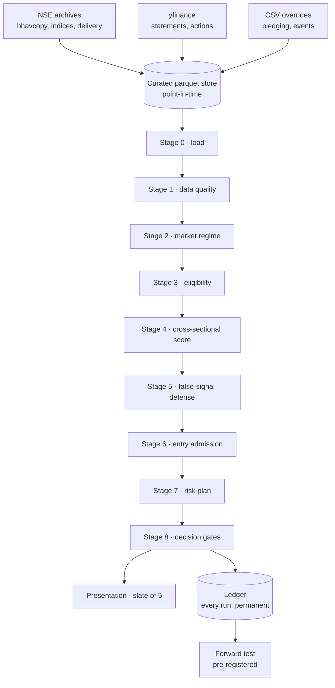

# ProSignal

A cross-sectional equity ranking engine for NSE cash equities. It reads
point-in-time market data, ranks the eligible universe on sector-neutral 6-1
momentum, and puts six names on a screen with the arithmetic that produced them
and the record of what that configuration has historically done.

It runs every session and buys every twenty-first. It issues opinions. It has no
order-routing code and no broker connection.

---

## Executive summary

| | |
|---|---|
| **Market** | India, NSE cash equities |
| **Universe** | ~750 names, liquidity-screened point-in-time |
| **Runs** | Every trading session, end-of-day |
| **Buys** | Every **21st** session. Running and buying are different events — see `prosignal/cadence.py` |
| **Horizon** | 63 sessions (~3 months), and the time limit is now the exit most winners take |
| **Ranking** | **`mom_6_1_r`** — the sector-neutral rank of 6-1 momentum, one column. The Fama–MacBeth model over 7 factor families is still fitted, recorded and monitored; it no longer chooses |
| **Book** | 6 names, equal weight, held while inside the top 18 |
| **Exits** | Rank band, 63-session limit, and a disaster floor at 8×ATR clipped to 35%. No profit target, no thesis-invalidation exit, no trailing stop |
| **Output** | A ranked shortlist, each with factor contributions and a trade plan |
| **Execution** | None. No orders, no broker, no automation |
| **Status** | **PAPER TRADING.** Every gate passes and the forward test is open. The configuration does **not** clear the Deflated Sharpe against its own trial count — see finding T5 — so it is a hypothesis under test, not an established result |

> [!IMPORTANT]
> **The holdout figures are withdrawn and have NOT been replaced.** They were
> computed on a training panel built from one universe — the names the liquidity
> screen admits today, projected backwards over every training date — and on a
> model whose value block was a constant for 74% of the universe. Both are
> fixed. The old numbers describe a model that no longer exists.
>
> The holdout has **not** been re-run, and that is a decision rather than an
> omission. It was already spent once; looking again would compound the
> multiple-testing problem the Deflated Sharpe exists to charge for, and would
> buy a nicer number at the cost of the one clean test left. The
> **pre-registered forward test** is the designed path to an out-of-sample
> answer, and it has **not** been re-registered. `data/ledger/forward_test.json`
> still names `baseline-v1@a30a8d4847080ddc` while the engine runs
> `baseline-v2@9ffe2b1b65e17832`; `prosignal research forward` reports the
> window INVALID on three counts (the config changed after registration, the
> pre-registration file no longer matches its hash, and the registration
> carries no benchmark-relative hypothesis). Until it is re-registered the
> observations are being recorded but are not evidence. The Settings drawer
> says so on the screen.

---

## What changed in the tuning pass (2026-08-29)

The engine was measured at TRADE level rather than at IC level: 4,877
configurations on a rebuilt point-in-time panel (2,212 sessions, 1,517
ever-eligible symbols), entries taken only on cron dates, exits checked every
session, and every result scored against an **investable equal-weight benchmark
of the same eligible universe** rather than against zero.

Four things changed, each on its own measurement. Findings T1–T6 in
`prosignal.validation.findings` carry the full arithmetic.

**The fitted composite stopped choosing what to buy.** It lost to the benchmark
in all 144 of its configurations; its own 6-1 momentum input, ranked
sector-neutrally and traded alone, returned +20.3% annualised alpha. The cause is
that the composite is fitted against a cross-sectional RANK, and rank rewards
ordering the middle of a distribution whose money is in the right tail — at H=63
its rank IC is +0.0338 while its **top-decile excess is −0.35%**. Three repairs
were tried and each failed on measurement: refitting on the return, using the
composite as an exclusion filter, and trading the engine's own three-column
momentum family. The composite is still fitted, still on the card, still
monitored by `research decay`.

**Three of the four price exits came off.** Measured one at a time rather than as
a bundle: the 3R target cost 0.9 points of annual alpha, the MA50 − 1.5 ATR
invalidation cost 14.3 and 15.6 points of per-trade win probability. The stop
went the other way — walked out to a **disaster floor at 8×ATR**, it *adds* 2.0
points of alpha (better in 52 of 54 paired configurations) and cuts the worst
single trade by 21.5 points. The invalidation level survives as the ADMISSION
predicate, which is a different and cheaper use of the same number.

**Buying became a schedule.** The engine still runs every session — the floor is
a price level, the rank band and eligibility can release a position any day, and
outcomes resolve daily — but new positions open every 21st session, counted in
sessions from a fixed anchor so a holiday cannot re-phase it. The 21-session stem
is the only one on the surface positive in all six calendar years.

**Every trade now records what it is.** Cadence, planned hold, risk at the floor,
and the frozen frequencies of the study it belongs to, written into the ledger
row rather than read from the config later. That is what makes the paper-trading
record scoreable against the engine's own claim and not only against the market.

### What the shipped configuration measured

258 trades over 7.5 years, net of 40 bps, against the equal-weight eligible
universe:

| | |
|---|---|
| Probability of a net profit | **57.8%** |
| Probability of beating the universe | **51.2%** |
| Mean net return per trade | **+7.09%** (median +3.65%) |
| Mean excess over the benchmark | **+3.74%** (median +0.69%) |
| Annualised book return | **+42.6%** vs benchmark +18.9% |
| Annualised alpha | **+20.3%**, 95% CI [+7.7%, +30.9%] |
| Sharpe / excess Sharpe | 1.59 / 1.12 |
| Maximum drawdown | −32.6% vs benchmark −42.4% |
| Positive alpha | **6 of 6** calendar years since 2021 |
| Median sessions held | 42 |

How a trade ends, which is where the shape of the distribution lives:

| exit | trades | win rate | mean net |
|---|---|---|---|
| rank band | 149 | 53.7% | +3.3% |
| time limit | 100 | **69.0%** | **+16.1%** |
| disaster floor | 9 | 0.0% | −31.0% |

Two thirds of the return comes from the 39% of positions that survive to the
time limit. Every rule that was removed was a rule that sold part of that
population early.

### What it has not cleared

| | |
|---|---|
| Deflated Sharpe, all 4,877 trials | **0.030 — FAILS** (threshold: annual excess Sharpe 1.80; this has 1.12) |
| Deflated Sharpe, variance within the winning family | 0.50 |
| Deflated Sharpe, within the final 378-cell surface | 0.97 |
| PBO (CSCV, 3,432 splits) | 0.388 — passes, not comfortably |

All three DSR readings are published because choosing one silently is how a
search gets laundered. The spread is driven almost entirely by the trial
variance, and the DSR's null — every trial has zero true Sharpe and they differ
only by noise — is false when the trials include signals that differ for real
reasons.

What supports shipping is different evidence: **every one of the 378
configurations on the final surface has positive mean excess over 2021–2026**,
the shipped cell is positive in all six years, and a stationary block bootstrap
(blocked at the holding period) puts annual alpha at [+7.7%, +30.9%] with
P(alpha ≤ 0) = 0.000 over 4,000 resamples. A six-year walk-forward of the
SELECTION PROCEDURE — choose the best cell on data available at each year end,
then trade it — returns +13.2% mean out-of-sample alpha against +8.9% for not
choosing at all, and lands at the 53rd percentile of the surface. That is the
honest reading: the region works and the exact cell within it is not identified,
which is why the plateau rather than the peak is what ships.

This is the best-supported hypothesis the search found. It is not an established
result. The forward paper-trading record is what would establish it.

---

## What changed in the tuning pass (2026-08-29)

The engine was measured at TRADE level rather than at IC level: 4,877
configurations on a rebuilt point-in-time panel (2,212 sessions, 1,517
ever-eligible symbols), entries taken only on cron dates, exits checked every
session, and every result scored against an **investable equal-weight benchmark
of the same eligible universe** rather than against zero.

Four things changed, each on its own measurement. Findings T1–T6 in
`prosignal.validation.findings` carry the full arithmetic.

**The fitted composite stopped choosing what to buy.** It lost to the benchmark
in all 144 of its configurations; its own 6-1 momentum input, ranked
sector-neutrally and traded alone, returned +20.3% annualised alpha. The cause is
that the composite is fitted against a cross-sectional RANK, and rank rewards
ordering the middle of a distribution whose money is in the right tail — at H=63
its rank IC is +0.0338 while its **top-decile excess is −0.35%**. Three repairs
were tried and each failed on measurement: refitting on the return, using the
composite as an exclusion filter, and trading the engine's own three-column
momentum family. The composite is still fitted, still on the card, still
monitored by `research decay`.

**Three of the four price exits came off.** Measured one at a time rather than as
a bundle: the 3R target cost 0.9 points of annual alpha, the MA50 − 1.5 ATR
invalidation cost 14.3 and 15.6 points of per-trade win probability. The stop
went the other way — walked out to a **disaster floor at 8×ATR**, it *adds* 2.0
points of alpha (better in 52 of 54 paired configurations) and cuts the worst
single trade by 21.5 points. The invalidation level survives as the ADMISSION
predicate, which is a different and cheaper use of the same number.

**Buying became a schedule.** The engine still runs every session — the floor is
a price level, the rank band and eligibility can release a position any day, and
outcomes resolve daily — but new positions open every 21st session, counted in
sessions from a fixed anchor so a holiday cannot re-phase it. The 21-session stem
is the only one on the surface positive in all six calendar years.

**Every trade now records what it is.** Cadence, planned hold, risk at the floor,
and the frozen frequencies of the study it belongs to, written into the ledger
row rather than read from the config later. That is what makes the paper-trading
record scoreable against the engine's own claim and not only against the market.

### What the shipped configuration measured

258 trades over 7.5 years, net of 40 bps, against the equal-weight eligible
universe:

| | |
|---|---|
| Probability of a net profit | **57.8%** |
| Probability of beating the universe | **51.2%** |
| Mean net return per trade | **+7.09%** (median +3.65%) |
| Mean excess over the benchmark | **+3.74%** (median +0.69%) |
| Annualised book return | **+42.6%** vs benchmark +18.9% |
| Annualised alpha | **+20.3%**, 95% CI [+7.7%, +30.9%] |
| Sharpe / excess Sharpe | 1.59 / 1.12 |
| Maximum drawdown | −32.6% vs benchmark −42.4% |
| Positive alpha | **6 of 6** calendar years since 2021 |
| Median sessions held | 42 |

How a trade ends, which is where the shape of the distribution lives:

| exit | trades | win rate | mean net |
|---|---|---|---|
| rank band | 149 | 53.7% | +3.3% |
| time limit | 100 | **69.0%** | **+16.1%** |
| disaster floor | 9 | 0.0% | −31.0% |

Two thirds of the return comes from the 39% of positions that survive to the
time limit. Every rule that was removed was a rule that sold part of that
population early.

### What it has not cleared

| | |
|---|---|
| Deflated Sharpe, all 4,877 trials | **0.030 — FAILS** (threshold: annual excess Sharpe 1.80; this has 1.12) |
| Deflated Sharpe, variance within the winning family | 0.50 |
| Deflated Sharpe, within the final 378-cell surface | 0.97 |
| PBO (CSCV, 3,432 splits) | 0.388 — passes, not comfortably |

All three DSR readings are published because choosing one silently is how a
search gets laundered. The spread is driven almost entirely by the trial
variance, and the DSR's null — every trial has zero true Sharpe and they differ
only by noise — is false when the trials include signals that differ for real
reasons.

What supports shipping is different evidence: **every one of the 378
configurations on the final surface has positive mean excess over 2021–2026**,
the shipped cell is positive in all six years, and a stationary block bootstrap
(blocked at the holding period) puts annual alpha at [+7.7%, +30.9%] with
P(alpha ≤ 0) = 0.000 over 4,000 resamples. A six-year walk-forward of the
SELECTION PROCEDURE — choose the best cell on data available at each year end,
then trade it — returns +13.2% mean out-of-sample alpha against +8.9% for not
choosing at all, and lands at the 53rd percentile of the surface. That is the
honest reading: the region works and the exact cell within it is not identified,
which is why the plateau rather than the peak is what ships.

This is the best-supported hypothesis the search found. It is not an established
result. The forward paper-trading record is what would establish it.

---

## RESULTS OF RECORD

> [!WARNING]
> **These supersede every other number in this file.** Earlier sections quote
> three mutually inconsistent CPCV results, produced at different times against
> different code. They are kept as history — a bad result is never deleted here
> — and each is marked SUPERSEDED where it appears. If a figure below and a
> figure elsewhere disagree, this table is the live one.

Regenerated end to end after remediation. Panel 35,730 rows over 85 dates;
selection period 2019-02-18 → 2025-02-03; holdout untouched.

**The ranking**

| | |
|---|---|
| Pooled rank IC (CPCV, 45 splits, 9 paths) | **+0.0449** |
| Top-decile excess | **+0.97%** per 63-session period |
| Distinct test dates / independent observations | 70 / **23.6** |
| Overlap-corrected t on the excess | **+1.20** (naive +2.06) |
| Pre-committed significance bar | **t ≥ 3.0** |
| Paths below zero | **11%** |
| Path Sharpe — min / median / max | −0.03 / +0.20 / +0.37 |
| Deflated Sharpe, charging **81** trials | **0.346 — FAIL** |

**The book, against the alternative it never used to be measured against** —
equal-weight eligible universe over the same 70 holding windows:

| | book | benchmark |
|---|---|---|
| mean return / period | **+1.04%** | **+5.27%** |
| Sharpe | +0.31 | +0.83 |
| mean excess | **−4.23%** | — |
| information ratio | **−0.83** | — |
| beta to benchmark | +0.32 | — |
| alpha / period | **−0.67%** | — |
| periods beating the benchmark | **32.9%** | — |
| worst drawdown on one schedule | −20.6% | — |

*(`portfolio_sim._path_drawdown` documents −21.7%, which was the same statistic
on the pre-W3/W5/W8 panel. −20.6% is the current figure.)*

**What the two tables say together.** The ranking carries a little information
— IC +0.045, and remediation raised it from +0.034. The machinery that turns
that ranking into a book destroys considerably more than the ranking creates:
measured arm by arm, ranking earns +1.82% per period over the benchmark, risk
budget sizing costs −1.14%, the 2.5×ATR stop costs −3.06%, the 3R target
−0.36% and costs −0.67%. **The engine's own book underperforms buying its own
universe equal-weighted, by 4.23% per period.**

**Two further qualifications on the ranking figures.**

*They describe the label, not the book.* The model is fitted against the
63-session forward return; the book earns whatever the stop, target and
invalidation level produce. Within-date rank correlation between the two is
**+0.529** — the label explains 28% of the variance of what is actually earned.
The book's positions leave by invalidation 39.2% of the time, by stop 32.2%, by
target 17.9%, by timeout 10.7%. (Code comments quote +0.531 / 39.3% / 32.1%
from the original audit's panel; the figures here are the re-measurement on the
remediated panel, and the difference is the remediation.)

*The traded coefficients are biased away from zero.* The gate selects on
\|t\| ≥ 2 from the same sample that estimated λ. Corrected for that selection,
`mom`'s implied true t is **+2.20** and `delivery`'s is **+1.46** — the second
does not clear the gate it passed. The correction is reported, not traded; see
`work/audit/W2_failure_model.md` for why it failed its own ship rule.

---

**Historical figures below are superseded.** No naive t-statistic is quoted
from CPCV, and the harness refuses to compute one: test dates recur across
splits and the woven paths share training data and one calendar, so neither is
a sample of independent experiments. The overlap-corrected figure in RESULTS OF
RECORD is what the harness will stand behind.

The honest summary is that the ranking carries a little information on the
selection period — pooled IC +0.045 — and that **the book which trades it
underperforms the universe it selects from by 4.23% per period**, with an
information ratio of −0.83 and alpha of −0.67%. The engine's problem is not
that its ranking is worthless; it is that the sizing, the stop and the costs
take more than the ranking creates. Whether any of it survives out of sample is
what the forward test is for, and it has not run yet.

---

## What ProSignal is

A **research instrument**. It ranks stocks by predicted 63-session forward
return using a gated Fama–MacBeth model over factors drawn from published
literature — the ridge is available and is not what ships — and
shows the reader the z-score, fitted coefficient and contribution behind each
name.

It is **rule-based and statistical**, not machine-learned in any modern sense.
The model is a penalised linear regression with a fixed penalty
(`alpha = 20000`). There is no neural network, no gradient boosting, no
reinforcement learning, and no language model anywhere in the signal path.

It runs **once per session on closing data**. There is no intraday component.

Its intended user is someone who can read a factor loading and knows what an
information coefficient is.

## What ProSignal is not

- **Not an autonomous trading system.** There is no order-placement code in
  this repository. The Upstox trading endpoints were reviewed and deliberately
  not wired.
- **Not a broker or portfolio manager.** Position sizing is computed and
  displayed; nothing acts on it.
- **Not AI-powered.** An AI agent was used to build and audit it. That is a
  fact about the development process, not about the engine.
- **Not a probability oracle.** The score is a rank within the day's eligible
  universe. See [Calibration](#calibration).
- **Not high-frequency.** The label is three months long.
- **Not validated as profitable.** See
  [What has not been established](#what-has-not-been-established).
- **Not investment advice.** It is a decision-support tool.

---

## Core philosophy

**Refuse rather than guess.** Where the engine cannot compute something
honestly, it says so and drops the component rather than substituting a
plausible number. The Stage 3 pledging gate reports `NOT_TESTABLE` — it does
not pass. A run whose ranking model could not fit is labelled as unscored on
the card.

**Cross-sectional, not absolute.** Every reading is relative to the same day's
universe. A momentum z-score of +1.5 means "high versus the market today", not
"high versus 2019". This removes the need for regime-dependent thresholds.

**The bar is stated before the test.** `validation.significance.t_stat_bar` is
3.0, following Harvey, Liu & Zhu (2016). It sits in the config, not in a
conclusion written afterwards.

**Negative results are kept.** Where research showed a component did not work,
it was removed and the finding recorded. See
[Research evolution](#research-evolution).

**Purge before you measure.** The label is 63 sessions; the purge is 63
sessions. It was 21 once, which left 42 sessions of every training row's label
window inside the test block. That leak flattered everything computed through
it and the loader now enforces `purge >= horizon`.

---

## System architecture



The stage names above are `STAGE_LABELS` in `pipeline.py` and the modules are
`src/prosignal/stages/stage1_*.py` … `stage8_*.py`.

---

## Data sources and lineage

| Source | Provides | Consumed by | Cadence | Caveats |
|---|---|---|---|---|
| **NSE archives** (`nse_archives.py`) | Daily bhavcopy OHLCV, index closes, delivery quantities, corporate actions, board meetings, equity master | Prices, indices, delivery, universe | Daily, EOD | **403s before 2016-01.** Delivery not re-servable before ~2021. Blocks datacentre IPs — an Indian host is materially safer |
| **yfinance** (`yfinance_provider.py`) | Income statement, balance sheet, cash flow; corporate actions as fallback | Valuation factors | Refreshed on a session cadence | **Period-end labels, no filing dates.** Bulk share-count coverage begins 2023-06. Availability is derived from the SEBI LODR deadline instead |
| **NSE Ind-AS** (`nse_fundamentals.py`) | Quarterly filings with true filing dates, 186 names | Legacy Stage 4 value/quality | **Defunct — stopped 2025-03-11** | 528 days stale; every symbol exceeds `max_fundamental_age_days`. These factors are dropped from every live run |
| **CSV overrides** (`csv_import.py`) | Promoter pledging, regulatory events, manual corporate actions | Stage 3 gates | Manual | **Pledging file is empty.** The gate reports NOT_TESTABLE |

### Lineage example — `deliv_pct`

```
NSE sec_bhavdata (delivery qty, traded qty)
  → store.write_delivery() → curated/delivery/year=YYYY.parquet
  → build_panel(delivery=…) → 60-session mean of delivered fraction
  → cross-sectional rank → deliv_pct_r
  → ridge coefficient +0.0235
  → contribution = z × coefficient
  → "Share of trading taken to delivery" under Participation
```

Delivered fraction is India-specific: NSE publishes how much of each day's
volume settled by delivery rather than being squared off intraday. It carries
the largest coefficient in the fit.

### Failure behaviour

Feeds are **required** or **optional** per `config/parameters.yaml` → `feeds`.
A missing required feed fails the run. A stale one is marked `STALE` in the
manifest with its age in sessions. An empty delivery panel raises rather than
defaulting to neutral — measured, treating it as neutral replaced a third of
the top decile and cost 18% of the IC while the run reported nothing.

Raw HTTP payloads are cached under `data/cache/` and LRU-evicted to 384 MB
after every ingest.

---

## Universe

Resolved **point-in-time** by `UniverseResolver.resolve_liquidity_pit()`:

| Filter | Value |
|---|---|
| Minimum ADTV | ₹5 crore over a trailing window |
| Minimum price | ₹20 |
| Minimum history | 300 sessions |
| Maximum names | 750 |

It is **not** a static NIFTY 200 list. The index snapshot is stored for
breadth and benchmark purposes; the tradable universe is rebuilt from
liquidity as it stood on each date.

**Survivorship.** The measured disappearance rate is **4.3%/year**. The
decision universe is rebuilt per date from stored data rather than from today's
listings, so a name that delisted in 2021 is present in 2020's universe.

The **training panel** did not do this until recently: it was built from the
screen resolved once, on the latest session. `crosssec.liquidity_mask` now
applies the same screen per date to the panel and to the equal-weight benchmark
that beta and residual momentum are measured against. It agrees with
`UniverseResolver.resolve_liquidity_pit` on about **88%** of names; the
remainder is window handling at the edges, and it is stated rather than implied.

The disappearance rate is also
the main reason history cannot be extended: vendors serving candles back to
2000 carry only currently-listed instruments, and a 26-year reconstruction
would be missing **68%** of the companies that actually traded.

---

## Time horizon

| Horizon | Value | Note |
|---|---|---|
| Label / model | 63 sessions | `forward_return_sessions` |
| Panel step | 21 sessions | Observations overlap 3:1 — see [Statistical validation](#statistical-validation) |
| Expected hold | 15–63 sessions | Reported per name |
| Purge | 63 sessions | Must equal or exceed the label |
| Embargo | 21 sessions | On top of the purge |
| Holdout | 378 sessions | Sacred; 2025-02-07 onward |

63 was chosen from a horizon surface, not tuned. It sits on a **plateau**
(21–84 sessions, 11.20–11.65% annualised net) rather than at a peak. H=84 buys
+0.06 Sharpe and costs 0.41pp of return, which is inside the CPCV noise band
(sd 0.83).

---

## Signal engine

### Stage 1 — Data quality

**Objective.** Reject names whose price history cannot be trusted.

**Rules.** Cross-source agreement against yfinance on the latest close; scan
of **260 sessions** for unexplained discontinuities; corporate-action
reconciliation.

**Output.** ~40 of 750 names excluded on a typical run.

**Rationale.** An unadjusted 1:10 split reads as a −90% session and corrupts
every lookback feature that spans it. The scan window covers the model's
longest feature lookback (253 sessions for `prox_52w` and `resid_mom`).

**Failure mode.** A corporate action published after the ex-date is invisible
until the next actions refresh. The 260-session scan bounds the exposure — the
name is rejected rather than mis-scored.

`stages/stage1_data_quality.py`

### Stage 2 — Market regime

**Objective.** Establish whether conditions resemble those the strategy needs.

**Calculation.** Two measures that must agree:

```
trend  = annualised slope of a 63-session OLS on log(NIFTY 200)
         AND close > 200-session SMA
vol    = India VIX percentile over trailing 252 sessions,
         split at the 33rd and 67th
```

**Rules.** Uptrend requires `slope > +0.05` annualised **and** price above the
200-session average. Downtrend requires both negative. Everything else is
range-bound.

**Rationale.** Requiring agreement is what stops it flapping. The moving
average alone calls a flat market trending whenever price sits a hair above
the line; the slope alone calls every bear-market bounce an uptrend.

**Evidence level.** The 200-day filter is conventional (Faber 2007 and the
CTA literature). **The windows — 50, 200, 63 — carry `status: UNVALIDATED` in
the config and were never searched on this data.** They are defaults, not
fitted values.

`stages/stage2_regime.py`

### Stage 3 — Eligibility

**Objective.** Remove names that cannot be traded or scored.

**Rules.** Liquidity, price floor, minimum history, regulatory cooldown,
promoter pledging.

**Output.** ~617 of 750 survive.

**Honest note.** The pledging gate has no data. It reports **`NOT_TESTABLE`**
and this appears on every run's data-quality flags. It does not pass.

`stages/stage3_eligibility.py`

### Stage 4 — Cross-sectional score

**Objective.** Rank every eligible name by predicted forward return.

**Calculation.** Ridge on standardised cross-sectional ranks:

```
β = (XᵀX + αI)⁻¹ Xᵀ y      α = 20000
score = Σ zᵢ · βᵢ
```

Fitted on `label_rank`, scored on the decision date's features. Training stops
**one full label horizon before** the decision date.

**Critically: the model refits on every run** from stored history, capped at
`MAX_TRAIN_SESSIONS = 3000`. **The store is the training set.** A short store
yields a model trained on a short history — the same code and config hash
producing materially different coefficients. See
[Known limitations](#known-limitations).

**Abstention.** Below `MIN_LOOKBACK + horizon + 60` sessions (**397** on the
shipped configuration; this read 376 against an older `MIN_LOOKBACK`) the model
refuses to fit. Stage 4 then falls back to a hand-weighted composite, which
was measured at **−0.047% excess per month, t = −0.11**. The fallback is
gated (`allow_composite_fallback: false` for non-benign failures) and a run
scored that way is flagged **"This shortlist is not from the model"**.

`stages/stage4_core_score.py`, `features/crossmodel.py`, `features/linear.py`

### Stage 5 — False-signal defense

**Objective.** Penalise names whose ranking rests on an artefact.

**Checks.** Liquidity distortion, gap, news spike, overextension,
beta-explained move, corporate-action distortion, earnings distortion,
low-volume breakout.

**Output.** A penalty subtracted from the percentile. ~52 of 617 clear every
check.

**Important scaling note.** The top 52 names occupy percentiles 90–100, and a
single penalty is −0.10. **One penalty moves a name across the entire visible
range.** This is why the interface orders on model rank rather than on the
penalised score — sorting on the latter put seven WATCHLIST names above every
BUY.

`stages/stage5_false_signal.py`

### Stage 6 — Entry admission

**Objective.** Decide which ranked names are opened.

**Rule.** A rank band with hysteresis:

```
enter if rank ≤ 8
hold  if rank ≤ 16 and already held
```

**Evidence.** This replaced a price-trigger gate. Measured on the holdout, the
trigger gate produced Sharpe **+0.46** against **+1.56** for rank admission —
it was destroying most of the strategy. Triggers are still computed and
reported; they no longer gate.

Band widths were tested by nested selection across a 7-point grid. Nested beat
the fixed convention by **+0.03 Sharpe on a distribution with sd 0.83**, and
the inner loop's chosen band scattered across the whole grid. That is noise,
not signal. 8/16 is retained on the index-construction convention.

`stages/stage6_entry.py`

### Stage 7 — Risk plan

**Objective.** Attach levels to an admitted name.

```
stop        = entry − 2.5 × ATR      (bounded 2%–15%)
invalidation= 50-session MA − 1.5 × ATR
size        = min(risk_budget / risk_per_share, capital_slot, adtv_cap)
```

**Measured, not assumed.** An earlier analysis claimed the stop consumed 89%
of alpha. That was wrong — it measured per-position, and sizing is
`risk_budget / risk_per_share`, so a **tighter stop buys a larger position**.
Corrected at portfolio level, 2.5× is near-optimal and was left unchanged.

`stages/stage7_risk.py`

### Stage 8 — Decision gates

**Objective.** Final admission and card assembly.

**Gates.** `min_universe_percentile: 90`, `max_signals_per_sector: 2`,
`max_pairwise_corr: 0.7`, `max_signals_per_run: 8`. Exposure checks are
**reported, not gating**.

`stages/stage8_final_signal.py`

### Presentation — the slate of five

Not a pipeline stage; it curates the engine's output without touching the
criteria. The slate is decided by the **run** and recorded with it, so the live
screen, the History page and the ledger all render one list rather than three
reconstructions of it.

- A name already on the screen **keeps its slot while its model rank stays
  inside `exit_rank`** — the same band Stage 6 admits on
- Only the slots it does not hold are filled: buys first, in **model-rank**
  order, then the ranked near-misses
- **It cannot manufacture a fifth.** 3 buys + 1 near-miss returns **4**, and
  says why
- Every departure is recorded with its reason

Real history confirms the last point: **2026-08-14 had two candidates in the
entire market and the slate showed two.**

**Why the hold band is on the screen too.** Without it the slate was a fresh
top-5 snapshot with no memory of the previous session, while the strategy
underneath it was patient. Measured on the recorded ledger: mean top-5 turnover
**74.9%**, median **80%**, and the median number of sessions a name survived on
the screen was **one** — under a card quoting a hold of roughly fourteen. The
displayed list and the validated strategy were two different products.

`presentation/selection.py`

### What is deliberately not here

Three things, down from six. The other three are now implemented and waiting on
coverage rather than on code.

| wanted | state |
|---|---|
| SUE and EAR (post-earnings drift) | `earnings_calendar.csv` is **empty**. SUE needs quarterly EPS history, which the feed has; EAR needs the announcement *date*, which it does not — the LODR deadline is a deadline, not a date, and dating the window off it would misplace it |
| ASM / GSM surveillance exclusion | no feed. Trade-for-trade settlement and 100% margin make backtest fills there fiction |
| Free-float-scaled market impact | no float data. Impact scales with traded value instead, and Indian promoter holdings are high enough that two identical-cap names can have floats differing threefold |

**Implemented, dropped on DATE SPAN, waiting on a deeper feed.** Value's five
ratios and quality's six are all computed. The fundamentals ingest was run and
took symbol coverage from **192 to 758** names — 100% of the universe — and they
are still dropped. The reason is not what it looks like:

| | |
|---|---|
| within-date coverage, on dates the factor exists | **65–73%** — above the 60% floor |
| panel dates the factor exists on at all | **33 of 88** — below the 60% span floor |

yfinance serves about five years of statements and TTM needs four quarters of
it, so the first usable panel date is **2023-06** against a panel starting
**2018-12**. These are two different failures and the engine now tests them
separately (`MIN_FACTOR_COVERAGE` and `MIN_FACTOR_DATE_SPAN`), because the
remedies differ: thinness needs more names, absence needs more history, and the
log has to say which.

Fitting them anyway would mean truncating the panel to 33 overlapping dates —
roughly eight independent 63-session windows — to estimate seven coefficients
instead of five. That is a worse trade than dropping two families.

**And value is now worth wanting.** With full coverage on the dates it exists it
is the strongest family measured:

| factor | IC | ICIR | t | dates |
|---|---|---|---|---|
| **value** (family) | **+0.0839** | +0.623 | +2.57 | 17 |
| `ebitda_to_ev` | +0.0845 | +0.756 | +3.12 | 17 |
| `fcf_yield` | +0.0533 | **+1.184** | +4.88 | 17 |
| `mom` (family) | +0.0673 | +0.501 | +4.19 | 70 |

Seventeen dates against a 63-session label is about **four independent windows**,
and `factor_ic`'s t is deliberately not overlap-corrected — treat it as an upper
bound. This is not evidence that value works. It is evidence that a fundamentals
source reaching back as far as the price history is the single highest-value
thing missing, and the code is already there to use it.

`quality` reads **−0.0177 at t −0.92** on the same 17 dates — not significant
either way. Note `accruals` at IC −0.0290: negative is Sloan's sign, and the
family negates it, so it contributes correctly.

**Size is computed and reported, not scored.** `log_mcap` reads IC **−0.2297 at
a hit rate of 0/17**. That is not a factor, it is three windows in which small
caps happened to win, and giving it a family coefficient equal in weight to
momentum would rebuild by hand the small-cap tilt the point-in-time panel fix
removed. The unintended-sector-bet problem size was raised against is solved by
ranking within sector, which is done.

**Continuous volatility-scaled momentum exposure** is approximated by Stage 2's
regime multiplier, which now actually reaches the fitted model — it did not
before, and was computed, logged, written to the ledger, printed on the card and
never applied to a score. A true inverse-volatility weight needs a momentum
factor-return series the engine does not build.

---

### Holding period, measured

`prosignal research factors` computes the composite's rank IC at 5, 10, 21, 42,
63 and 126 sessions and nets it against what turning the book over that often
costs:

| horizon | IC | ICIR | turns/yr | cost | net |
|---|---|---|---|---|---|
| 5 | +0.0015 | +0.012 | 50.4 | 18.89% | −18.88% |
| 21 | +0.0166 | +0.138 | 12.0 | 4.50% | −4.33% |
| 63 | +0.0480 | +0.526 | 4.0 | 1.50% | −1.02% |
| **126** | **+0.0780** | **+0.710** | **2.0** | **0.75%** | **+0.03%** |

**Read the shape, not the levels.** `gross` converts a rank IC to an annual
return at a fixed 0.10 — a rule of thumb, not a measurement, and the
`alpha_per_ic` argument exists so it can be replaced with a fitted number. What
survives that assumption is the **ordering**: IC rises monotonically with
horizon, so a longer hold keeps more of whatever the edge turns out to be. What
does not survive it is any absolute claim about profitability.

The engine's configured 63-session hold is on the right side of that curve and
is not its maximum.

---

### A theme with a small coefficient, and a theme that is dying

The gated estimator already zeroes a theme that cannot clear |t| ≥ 2, so a dead
theme stops being traded. That is a **control**, not a monitor: it acts, then
says nothing about why — and a theme flickering in and out of the book across
refits looks identical to one quietly dying.

The two call for opposite responses. A small coefficient this quarter is noise
and should be left alone. A coefficient that has walked monotonically to zero
over years is a dead factor, and refitting it every 21 sessions in the hope it
returns is how a strategy outlives its edge.

**The kill criterion, declared in config before the numbers were looked at:**

> A theme is killed when its trailing 24-date Newey-West t has been
> **non-positive** on every check across a **complete refresh** of that window.

Both halves are chosen for a reason, not for a score. *Non-positive* rather than
a threshold, because a t at or below zero says there is no positive relationship
left at all — a sign test, not a level somebody picked. *A complete refresh*
rather than "a few checks", because the rolling windows overlap almost entirely;
requiring the breach to persist until every observation in the window arrived
*after* it began means no single bad quarter can end a theme.

| theme | full λ | t | recent λ | t | expected | of exp. | breach | verdict |
|---|---|---|---|---|---|---|---|---|
| `mom` | +0.0704 | +3.35 | +0.0587 | +2.63 | +0.0296 | **198%** | 0 | keep |
| `delivery` | +0.0454 | +3.35 | +0.0493 | +1.65 | +0.0191 | **258%** | 0 | keep |
| `risk` | +0.0188 | +0.97 | +0.0229 | +1.10 | +0.0079 | — | 0 | keep |
| `reversal` | −0.0027 | −0.22 | −0.0096 | −0.50 | −0.0011 | — | **9** | keep |
| `lottery` | +0.0065 | +0.10 | +0.1180 | +1.11 | +0.0027 | — | 0 | keep |

**No theme meets the criterion.** `reversal` is breaching but for 9 checks, not
24 — breaching is not dying, and that distinction is the whole reason the rule
requires a full window refresh.

**The haircut.** McLean & Pontiff (2016) measured 97 published anomalies and
found returns fall roughly 58% out of sample after publication — about a third
statistical bias, the rest real arbitrage once the paper was read. Every theme
here comes from a published paper, so the honest expectation is the *haircut*
coefficient, and a theme merely meeting it is behaving exactly as the literature
predicts. `mom` and `delivery` sit at 198% and 258% of theirs.

`of exp.` is blank where the full-sample coefficient is itself indistinguishable
from zero: there is no expectation to fall short of. Dividing by noise had
printed `reversal` at **837%** and `lottery` at **4341%**, both reading as though
the theme were thriving.

`validation/decay.py`, `research decay`

---

### Volatility scaling: leverage is not alpha

Moreira & Muir (2017) show that scaling a portfolio by the inverse of its recent
realised variance raises the Sharpe ratio — volatility is far more forecastable
at short horizons than return is, so the overlay decides *size* without
predicting direction at all.

Note first what was already there: position sizing is **already**
inverse-volatility, through the ATR stop. `risk_budget / (entry × atr_distance)`
gives a high-ATR name a smaller position by construction. What was missing is
the separate, aggregate question — how much book to have on at all.

Measured over 50 out-of-sample rebalances:

| target vol | mean ret | sd | **Sharpe** | vs off | t | avg scale |
|---|---|---|---|---|---|---|
| **off** | +3.12% | 7.87% | **+0.79** | — | — | 1.00 |
| 10% | +2.64% | 7.31% | +0.72 | −0.47% | −1.00 | 0.73 |
| 15% | +3.34% | 9.15% | +0.73 | +0.22% | +0.52 | 1.00 |
| 20% | +3.79% | 10.08% | +0.75 | +0.68% | +1.65 | 1.20 |
| 25% | +4.19% | 10.96% | +0.76 | **+1.07%** | **+2.21** | 1.34 |

A 25% target returns **+1.07% more per period at t +2.21** — and none of it is
alpha. Average exposure is **1.34×**, volatility rises from 7.87% to 10.96%, and
the **Sharpe falls**. Read on mean return the overlay looks like it works, and a
t-statistic on the return difference will happily confirm it. Read on the only
measure invariant to how much of the book is on, switching it off wins.

It ships disabled. The overlay also reads *market* volatility — the equal-weight
index — rather than average single-name volatility, because forty independently
wild names make a calm index and a portfolio-level overlay is right to ignore
the part that diversifies away.

`research volscale`

---

### The trial count was a number somebody typed

The Deflated Sharpe Ratio charges a result for the configurations tried before
it. That number was a command-line default of **24**, plus a config field
`cumulative_trials_logged` shipped at **0** with a comment asking a human to
update it after every campaign. Nobody ever did, and nothing checked. The
engine's central defence against selection bias was a constant entered once.

Trials are **counted** now, by the research commands themselves, into an
append-only registry keyed by (command, configuration) — so re-running the same
comparison does not inflate the count, and running a new one does.

| | |
|---|---|
| `research spread` | 18 configurations |
| `research estimator` | 5 |
| `research metalabel` | 1 |
| carried from earlier campaigns | 20 |
| **charged by the DSR** | **44** |

The carried 20 are the comparisons made while building the engine that no
command re-runs — four barrier calibrations, three risk-family orientations, two
shrinkage targets, two significance floors, two τ² estimators, five meta-label
shortlist widths, two meta-label readings — enumerated in the config so they can
be argued with. Everything before the registry existed is still uncounted; that
cannot be reconstructed and is not silently assumed to be nothing.

`research trials` prints the audit trail. Overriding the count downward is
announced, because charging fewer trials than were looked at is the bias the DSR
exists to remove.

### CPCV under the new label and estimator — SUPERSEDED

> [!CAUTION]
> **Superseded by RESULTS OF RECORD.** Kept because a bad result is not
> deleted. Two things are wrong with it beyond being stale. "2,401 scored
> dates" counts (split, date) PAIRS — each date appears in many splits, so the
> real figure was 70 distinct dates and about 24 independent observations. And
> the Deflated Sharpe of 1.000 came from a defect: it ran on the duplicated
> pooled vector with a null variance of 1/(n−1) at n = 2,401, which made the
> multiple-testing defence insensitive to multiple testing. It passed at
> 100,000 trials. Repaired, the same data gives **0.346 — FAIL**.

| | |
|---|---|
| splits fitted / paths woven | 120 / 36 of 36 |
| pooled rank IC | +0.0288 |
| top-decile excess | **+0.87%** per 63-session period, over 2,401 scored dates |
| path Sharpe — min / median / max | **+0.03** / +0.27 / +0.55 |
| paths below zero | **0%** |
| Deflated Sharpe, charging 44 trials | 1.000, pass |

**A NaN was being printed as a number.** The top-decile excess read `+nan%`. A
model that predicts the same value for every name has no top decile —
`rank(pct=True)` gives every tied element the midrank, the mask selects nothing,
and the mean of an empty slice is NaN, which then poisoned the pooled average
while every other line in the table read normally. 98 such dates are now
excluded and reported rather than averaged in.

### PBO existed, and was called by nothing

`compute_pbo` had been implemented and tested for months, and no code path
invoked it — while the CPCV output printed *"PBO for promotion to VALIDATED:
≤ 50%"*, quoting a bar against a number the engine never computed.

It is computed now, over the full theme set and every single-theme and drop-one
variant. **PBO 35%, pass.** Two configurations — `lottery alone`, `reversal
alone` — the estimator refuses outright and are excluded, because a
configuration that cannot be traded is not one anybody could have chosen. That
exclusion is itself a fix: one empty column plus a row-wise `dropna` had deleted
every date for every *other* configuration, so a single unusable arm made PBO
uncomputable rather than merely absent.

**The pass means almost nothing.** The configurations refuse on different
splits, so only **7 dates** were scored by all of them. A PBO on seven
observations has a sampling error wider than the bar it is compared to. It is
reported with that stated, because the alternative — quoting a bar against a
number never computed — is worse.

`validation/registry.py`, `research trials`

---

### The NO TRADE veto, and why it is switched off

A rank is relative by construction: somebody is always top of the list, on the
best day of the decade and on the worst. The primary model is good at saying
which of two names is better and says nothing about whether the better one is
worth buying — and the engine buys the top of that list every rebalance.

Meta-labelling (López de Prado, ch. 3) splits the two questions. A second binary
model, fitted **only on the trades the primary would actually have taken**,
predicts whether one reaches its profit barrier before its stop. It has no long
side — it cannot propose a name the primary did not — so its only power is to
veto. That is exactly the shape a NO TRADE gate needs, and the triple-barrier
label already supplies the ground truth.

It is built, wired, tested, and **disabled**, because it does not work here:

| | |
|---|---|
| pooled AUC | **0.5698** |
| mean per-date AUC | **0.4996** (t vs 0.5 = **−0.02**) |
| dates above 0.5 | **50%** |
| top-half minus bottom-half | −0.16% per period, t −0.15 |

The pooled figure is the pooled-N illusion in a new place. Pooling across dates
lets *"this was a good period"* masquerade as *"this was a good name"*. Within a
date — the only question a per-name veto can answer — it is a coin. Calibration
is wrong in the direction that matters too: the top bucket predicts **0.817** and
realises **0.547**.

Read as a **date-level** gate the signal reappears (trading only the
higher-probability half of dates returns +8.62% against +0.86%), but that is
market timing rather than trade selection, it rests on ~13 independent windows
once the 63-session overlap is counted rather than 40, and it was found by
looking a second time after the first look failed.

The binding constraint is **data**, not code: eight positions over seventy
rebalances is roughly 370 decided trades in the entire history. Re-run
`research metalabel` when the panel is longer.

**Two defects the wiring exposed, both found by running it rather than by a
test.** The classifier was not being cached, so on the 20-of-21 sessions that
score from a cached model no probability existed — and a gate whose rule is
"unknown is not approved" silently refused the whole book. Buys fell 8 → 4 (the
4 being held positions, which are exempt) with no error anywhere. And an enabled
veto that cannot score now *states* a refusal rather than skipping candidates
one at a time, which had produced an empty book under a full funnel — the exact
shape of a day the market offered nothing.

`features/metalabel.py`, `research metalabel`

---

### The funnel was not the funnel

Chasing the veto through the interface turned up something older: the pipeline
**rebuilt the funnel by hand** whenever a run produced a trade, using
`entries.triggered()` — the population *before* the score gate. Stage 8
documents having fixed exactly that non-monotonic ordering; the fix never
reached the screen, because the screen was reading a different dict.

Stage 8 now returns its own counts on every exit path, and the pipeline renders
them. An AST-parsed test asserts every exit hands them back.

---

### What the buy/hold spread actually buys

The engine enters at rank 8 and holds until rank 16. That gap is the whole of
its turnover control, and it had never been priced — the simulator netted cost
into the return and threw the parts away, so the saving a wider band exists to
capture was invisible in every number the engine reported.

Gross and cost are now carried separately. Measured on 50 out-of-sample
rebalances, paired period by period against a book with **no hysteresis at
all**:

| band | net diff | t (NW) | gross given up | cost saved | wins |
|---|---|---|---|---|---|
| 8/10 | −0.086% | −1.03 | −0.089% | +0.003% | 10% |
| 8/12 | −0.199% | −1.69 | −0.207% | +0.009% | 32% |
| **8/16 — shipped** | **−0.257%** | **−0.93** | **−0.282%** | **+0.026%** | 36% |
| 8/20 | −0.317% | −0.77 | −0.378% | +0.061% | 50% |
| 8/25 | −0.310% | −0.93 | −0.402% | +0.092% | 48% |

**The spread gives up roughly ten times more gross alpha than it saves in
commission.** Holding a name that has slipped to rank 14 instead of replacing it
with the current rank-8 name costs 0.28% a period; not paying that name's entry
cost saves 0.026%.

It is **not** significant — t −0.93 on 50 periods — so the band is not being
changed on this evidence. What the table does establish is the shape: at this
cost level (round trip ~37–76 bps) and this book size, turnover is cheap and
signal freshness is not. The band is buying the wrong thing.

An entry rank above the slot count is inert — with 8 slots the 10th candidate is
never reached — and the command now says so instead of printing duplicate rows
as if they were different configurations.

`research spread`

---

### N is 70, not 33,569

The pooled ridge stacked every (symbol, date) row into one design matrix and
solved once. With ~33,000 rows it behaves as though it has 33,000 independent
observations. It does not — the panel is **70 cross-sections**, and within a
date every name shares the same market, the same policy news and the same flow.
A pooled standard error divides by the square root of the wrong number.

Coefficients are now estimated by **Fama-MacBeth (1973)**: one cross-sectional
regression per date, and the slope series is the sample. Newey-West at 2 lags
charges for the overlap a 63-session label sampled every 21 induces. On the real
panel:

| theme | λ | se (NW) | t |
|---|---|---|---|
| `mom` | +0.0704 | 0.0210 | **+3.35** |
| `delivery` | +0.0454 | 0.0136 | **+3.35** |
| `risk` | +0.0188 | 0.0194 | +0.97 |
| `reversal` | −0.0027 | 0.0123 | −0.22 |
| `lottery` | +0.0065 | 0.0648 | **+0.10** |

**Three of five themes the ridge was weighting cannot be distinguished from
zero.** And `lottery` is worse than useless: the pooled fit gave it **−0.0143**,
while lottery measures **IC +0.0485** in this universe. The blend was betting
against it, and `mom_f − lottery_f` reads IC **+0.0031** against `mom_f` alone at
**+0.0481**. One wrong-signed theme was cancelling the one theme that works.

### The control arm the engine had never been run against

DeMiguel, Garlappi & Uppal (2009) found 1/N beat fourteen optimising rules out of
sample, because estimation error cost more than optimisation gained. Purged
walk-forward, 50 out-of-sample dates:

| arm | IC | t (NW) | hit | top-decile | t |
|---|---|---|---|---|---|
| ridge — *was production* | +0.0021 | +0.06 | 48% | −0.11% | −0.17 |
| **equal weight 1/N** | −0.0022 | −0.07 | 50% | −0.38% | −0.79 |
| Fama-MacBeth raw | +0.0100 | +0.31 | 58% | −0.06% | −0.11 |
| shrunk, no gate | +0.0434 | +2.25 | 62% | +0.71% | +1.54 |
| **gate \|t\|≥2, then shrink** | **+0.0516** | **+3.25** | **78%** | **+1.12%** | **+2.33** |
| momentum alone | +0.0481 | +2.36 | 68% | **+1.52%** | **+3.20** |

The production ridge did not beat the control it exists to justify.

**Two honest caveats.** Momentum *alone* still has the best top-decile excess —
the gated estimator is not kept because it beats a single factor today, but
because it collapses to momentum on its own when nothing else measures, and
admits `delivery` on the windows where delivery earns it. A one-factor engine
can do neither. And these arms were compared on the same dates that informed the
design, so every row above counts as a trial when a Sharpe is deflated.

### Shrinkage, and two ways to get it wrong

Surviving themes are shrunk by precision (Jensen, Kelly & Pedersen 2023):
`λ_shrunk = τ²/(τ² + se²) · λ`. Two things had to be got right.

**τ² by DerSimonian–Laird, not by the plain moment estimator.** `mean(λ²) −
mean(se²)` assumes the themes are measured equally well. They are not — standard
errors differ by 5× between `mom` and `lottery` — so one badly-measured theme
drove τ² to zero and took a theme sitting at **t = 6** down with it, zeroing an
entire walk-forward fold. Inverse-variance weighting gives each theme a say
proportional to how well it is known. A test caught this, not a run.

**Shrink toward zero, not toward the prior-oriented pool.** Pooling is the
Jensen–Kelly–Pedersen reading, and it is only safe when the orientation is
trustworthy. `lottery` carries a documented negative prior and measures positive
here, and because its standard error is large the pool hands it *nearly the full
prior mean* — a confident coefficient built out of nothing but the assumption.

The floor is pre-committed at **|t| ≥ 2**. A floor of 1.65 measured *better* out
of sample (IC +0.0553 against +0.0510) and was rejected for exactly that reason.

`features/famamacbeth.py`

---

### What `risk` actually measures

Its two members are **−0.35** correlated within date, so the equal-weight
composite cancels the common low-risk axis and keeps the residual — names whose
drawdown is shallow *relative to what their beta implies*.

| composite | IC | ICIR | t |
|---|---|---|---|
| `(beta + max_dd)/2` — as built | +0.0326 | **+0.384** | +3.21 |
| `(−beta + max_dd)/2` — proper BAB | +0.0224 | +0.089 | +0.75 |
| `max_dd` alone | +0.0389 | +0.176 | +1.47 |

The correctly oriented low-risk composite is the **weakest** of the three, so
the Frazzini–Pedersen prior cannot be claimed for this column. `risk` is
therefore given no prior sign at all rather than one read off the same data the
shrinkage is meant to discipline.

---

### The label is the trade, not the horizon return

The engine promises a stop and a holding period, and used to fit against the
return 63 sessions later as though neither existed. That label is blind to the
path — a name that fell 20% and recovered by day 63 scored the same as one that
drifted up quietly, and the engine was stopped out of the first in week two.
Fitting against it teaches the model to like trades it would have closed at a
loss.

> [!CAUTION]
> **SUPERSEDED — the triple barrier is OFF on the shipped path.**
> `labels.triple_barrier: false`. Fitting the ranker on the engine's own exit
> geometry made the label a function of the stop, so the model learned to
> predict its own risk management rather than returns. This section describes
> the label as it was; the shipped label is the plain 63-session forward
> return, and the consequences of that choice are in RESULTS OF RECORD —
> notably that the label now explains only 28% of the variance of what the
> book earns.

Labels were **triple-barrier** (López de Prado, ch. 3): profit barrier, stop
barrier, time barrier, and the label is whichever is touched **first**. On a
constructed case:

| | old horizon label | triple-barrier |
|---|---|---|
| a name that round-trips | **+2.00%** | **−13.31%, stopped on day 17** |
| a name that runs | +28.49% | +16.01%, target on day 54 |

Barriers are in units of the name's **own** horizon volatility, so they mean the
same thing for a 1.2%-sigma large cap and a 4%-sigma midcap. A bar touching both
counts as the stop — daily bars cannot order intraday events, the same
convention `backtest._simulate` uses. Intraday highs and lows do the touch test,
because a stop is not a close-only instrument.

**Calibrated, not chosen.** Measured on the real universe over 91 panel dates:

| upper/lower | target | stop | timeout | uniqueness | median hold |
|---|---|---|---|---|---|
| 2.0/1.5 | 14% | 10% | **76%** | 0.404 | 63 |
| 1.5/1.0 | 23% | 24% | 52% | 0.462 | 63 |
| **1.0/0.75** | **37%** | **36%** | **27%** | **0.576** | **34** |
| 0.8/0.6 | 42% | 45% | 13% | 0.682 | 23 |

At 2.0/1.5 three quarters of labels time out and the label collapses back into
the horizon return it exists to replace. At 0.8/0.6 it is measuring noise.

### Overlapping labels are not independent observations

A 63-session label sampled every 21 shares two thirds of its window with its
neighbour. An unweighted fit counts one market shock once per overlapping row —
the panel has ~33,000 rows and nothing like 33,000 independent observations.

Each row is weighted by its **average uniqueness**: the mean of 1/concurrency
over its own span (López de Prado, ch. 4). Measured here at **0.576**, so the
panel carries roughly 19,000 independent-equivalent observations rather than
33,000. Uniqueness is computed **within a symbol** — thirty names on one date
are thirty correlated observations, not a thirtieth of one, and pooling them
returned 0.014 and would have discarded almost the whole panel.

**What changed when the label did.** Refitting on the barrier label moves two
families materially:

| family | horizon label | triple-barrier |
|---|---|---|
| `reversal` | +0.0042 | **+0.0105** |
| `risk` | +0.0040 | **−0.0002** |

Reversal more than doubles, and `risk` — beta and max drawdown — collapses to
nothing. That is what you would expect: with a stop *inside* the label, "shallow
drawdown" stops predicting, because the stop is already handling drawdown.

`features/labels.py`

---

### Families, not seventeen coefficients

Seventeen coefficients over a set this collinear is not estimable, and the
near-uniform coefficient band was the model saying so. Members are averaged as
ranks first and **one coefficient is fitted per family**:

| family | members | coefficient |
|---|---|---|
| `mom` | `resid_mom`, `prox_52w`, `mom_6_1` | **+0.0250** |
| `lottery` | `max5_21`, `idio_vol`, `idio_skew`, `downside_vol` | **−0.0187** |
| `delivery` | `deliv_pct`, `deliv_trend` | **+0.0157** |
| `reversal` | `resid_reversal` | +0.0042 |
| `risk` | `beta_120`, `max_dd_120` | +0.0040 |
| `value` | five ratios | *dropped — 12% coverage* |
| `quality` | gross profitability, cash operating profitability, ROCE, −accruals, −asset growth, −net issuance | *dropped — 10% coverage* |

Three members enter `quality` **negated**, so a higher composite is always a
better name: high accruals must cancel high profitability rather than add to it.
Net issuance is adjusted for bonuses and splits from the corporate-actions
table — a 1:1 bonus doubles the share count and dilutes nobody, and the raw
count cannot tell that from a placement.

**Liquidity is not scored at all.** The illiquidity premium is real but it is
compensation *for* trading costs, and a manual executor pays that cost rather
than collecting it — a positive `amihud` loading walks the book into names where
realised slippage exceeds forecast alpha. It stays in the universe screen as a
floor, which is where `universe.pit_min_adtv_inr` already put it.

The measurement agrees with the argument. Standalone rank IC over 70 dates:

| factor | IC | ICIR | t |
|---|---|---|---|
| `prox_52w` | +0.0660 | +0.462 | +3.87 |
| `mom_6_1` | +0.0549 | +0.434 | +3.63 |
| `resid_mom` | +0.0536 | +0.418 | +3.50 |
| `max_dd_120` | +0.0541 | +0.327 | +2.74 |
| **`amihud`** | **+0.0087** | **+0.090** | **+0.75** |
| **`turnover_ratio`** | **−0.0155** | **−0.175** | **−1.47** |

And the families beat their own best member on ICIR, which is what averaging
correlated members is supposed to do:

| family | ICIR | best member |
|---|---|---|
| `mom` | **+0.505** | +0.462 (`prox_52w`) |
| `risk` | **+0.488** | +0.327 (`max_dd_120`) |
| `delivery` | **+0.420** | +0.388 (`deliv_trend`) |

Run it yourself: `prosignal research factors`.

**Every rank is taken within a group.** A sector holding at least 12 names is
its own group; every other name — no sector at all, or a sector below that
floor — is ranked within a single residual `UNCLASSIFIED` pool. Ranking across
the whole market compares a bank's leverage with an IT firm's, so every factor
would otherwise carry an unintended sector bet on top of what it measures.

> [!NOTE]
> This sentence used to read *"all ranks are taken within sector [...] a thin or
> absent sector falls back to the universe rank"*, and the two halves
> contradicted each other. The fallback was not a detail: **58% of rows carried
> a sector label and a median 46% of names per date were ranked within one**, so
> roughly half of every cross-section was on the OTHER scale. A within-sector
> rank of +0.9 in a fourteen-name sector and a universe rank of +0.9 are
> different quantities, and both were averaged into the same family aggregate.
> The residual pool now fixes that; `sector_rank_coverage()` reports the split.
> Within-sector coverage on the current panel: median 41.2%, range 0–54.9%.

### The flat-day gate

`min_universe_percentile = 90` cannot express "flat day": the score is a rank, so
its distribution is uniform every session and the top 10% is admitted whether or
not it is any better than the middle.

Stage 8 gates on the model's **raw** spread instead — the gap between its top
decile's prediction and its median's, as a fraction of what that model normally
manages on its own training panel.

A ratio, not a level, and the reason is worth recording: the level is a function
of the ridge penalty rather than of the market. Measured across 88 panel dates
the entire range was **0.0355 to 0.0607**, so a floor of 0.15 — which is where
this started — would have blocked **100% of days**. That number was tried,
measured, and replaced.

A flat day **blocks new entries and keeps the book**. A day with no view is a day
to add nothing, not a day to liquidate.

---

### What SCORE is, in units

The card shows a SCORE of e.g. 0.898 and factor contributions summing to
about 0.12. They are **different units**, and nothing used to say so.

```
raw = Σ (z_factor × coefficient) + intercept      the contributions sum to THIS
    ↓  rank across today's eligible universe
    ↓  map rank onto [0, 1]  via (rank−1)/(n−1)
SCORE = 0.898   →  "89.8th percentile of the names eligible today"
```

So SCORE is a **cross-sectional percentile**, stable in meaning across days only
in the sense that 0.9 always means "top decile of that day's universe". It is
not a probability, and it is not the sum of the contributions. Stage 5 penalties
subtract from it afterwards, which is why a penalised name can sit below its
pre-defence percentile.

This is also why `min_composite_score = 0.60` and `min_universe_percentile = 60`
are arithmetically the same test — the config already notes it.

---

### What the score is actually made of

Measured on the live universe, mean |contribution| per factor, and the pairwise
rank correlations that say how much of it is one bet:

| Block | Factors | Share |
|---|---|---|
| Delivery | `deliv_pct`, `deliv_trend` | 25% |
| Momentum | `resid_mom`, `prox_52w`, `mom_6_1` | 41% |
| Liquidity | `turnover_ratio`, `amihud` | 14% |
| Risk | `downside_vol`, `beta_120`, `max_dd_120`, `max5_21` | 10% |
| Value | five ratios | **dropped — see above** |

**The blocks are not independent.** Pairs above the |ρ| = 0.60 cutoff:

| pair | ρ | reading |
|---|---|---|
| `amihud` / `turnover_ratio` | **−0.869** | one factor measured from two sides |
| `resid_mom` / `mom_6_1` | **+0.770** | |
| `resid_mom` / `prox_52w` | **+0.601** | the momentum block is close to one bet with three coefficients |

Ridge does not pick a winner among collinear inputs, it spreads the penalty
across the block — so the effective momentum weight is larger than any single
coefficient suggests. The redundancy check now measures **the model's own
features**; it previously ran on the hand-weighted composite's block and never
saw these.

One pairing the numbers **refute**: `max_dd_120` / `downside_vol` sit at
**−0.372**, not above 0.7. They are genuinely different information and both stay.

---

### What holds a position open

Three separate mechanisms had to agree before the book could actually be
patient, and none of them did.

| | Was | Is |
|---|---|---|
| Stage 8 entry caps | Sector, correlation and book-size caps applied to held names in score order, demoting them to WATCH — which deleted the position, since `signals_generated` is the only record of the book | Applied to **new entries only**, measured against the book that exists |
| Regime block | Returned an empty book, which did not pause the strategy but liquidated it | Stops new entries; the book is untouched. What closes a position is the exit band |
| A held name that fell out of the universe | Stopped appearing; the position left the book by omission with no exit recorded | `positions.review_open_position` decides: hold-and-flag a reconstitution or suspension, force an exit on a delisting, and say so on the screen |

Measured on the recorded ledger over adjacent sessions, of 54 held-name
transitions only **12 stayed in the book**: 19 were demoted by an entry cap and
23 left the payload entirely.

`stages/stage8_final_signal.py`, `positions.py`

### How a realised outcome is scored

A position ends at the **earliest** of: the stop, a target, the engine's own
exit, or the holding-period limit. Entry is at the next session's open, and a
bar touching both stop and target counts as the stop.

**The engine's own exit was missing.** The book is the exit rule — Stage 6 holds
while the name stays inside `exit_rank` — and outcome resolution modelled only
the levels. Measured on the recorded record: the simulation held past the
engine's actual exit in **94% of trades**, by a median of **14 sessions**. Every
figure the History page showed was computed over those phantom sessions.

**Decision levels are re-based before they are compared.** The stop and targets
are stored as plain numbers in the price basis of the run date; the store
re-adjusts its whole history whenever a corporate action lands. BAJFINANCE was
signalled on 2025-05-02 with a stop of 8195.05 against a close of 8862.50; a 4:1
bonus with a 2:1 face split landed on 2025-06-16, and that session now reads at
a close of 886.25. The stop sat ten times above every subsequent low, so the
position "stopped out" on its first bar — a loss recorded as **+823%**. Twenty-
nine trades cleared +50% this way and the record's mean return read **+53%**.

The correction is the stored close over the recorded close for the signal
session, which *is* the cumulative adjustment since the run. It needs no
corporate-action lookup. A trade whose basis cannot be established is **refused
and counted**, never scored on whichever basis was handy.

Outcomes carry the `exit_model` that produced them and only the current model is
served, so two exit rules can never be averaged together.

`outcomes.py`

---

## Feature reference

Suffix `_r` denotes the cross-sectional rank.

> [!WARNING]
> **The five value factors are not currently active.** The statements feed
> covers **192 of 750** names, so on the training panel they carry **10–12%**
> coverage and are dropped by `crossmodel.MIN_FACTOR_COVERAGE`. The engine fits
> **12 factors**, not 17, and says so in the model blob's
> `dropped_for_coverage`.
>
> They were previously neutral-filled. Every name without a statement landed on
> exactly the same rank for all five, which is why they read as five identical
> z-scores of −0.01 on a card — identical to two decimals across five ratios
> built from five different line items. Worse, the gap is not random: names WITH
> statements have **7.5× the median turnover** of names without (₹176 cr against
> ₹23 cr), so the block was substantially a disguised size bet.
>
> **The binding constraint is the feed, not the factor list.** Quality,
> profitability, accruals, asset growth and net issuance are all worth adding
> and none of them can be added until fundamentals cover the universe rather
> than its largest quarter.

| Feature | Lookback | Definition | Reference |
|---|---|---|---|
| `mom_6_1` | 147 | 6-month momentum skipping the last month | Jegadeesh & Titman (1993) |
| `resid_mom` | 253 | Momentum of market-residual returns, 252→21 | Blitz, Huij & Martens (2011) |
| `reversal_1m` | 22 | Last 21-session return | Jegadeesh (1990) |
| `prox_52w` | 253 | close / 252-session high − 1 | George & Hwang (2004) |
| `max5_21` | 22 | Mean of 5 largest daily returns in 21 | Bali, Cakici & Whitelaw (2011) |
| `downside_vol` | 61 | Downside deviation, 60 sessions | — |
| `beta_120` | 121 | OLS beta vs equal-weight universe | Frazzini & Pedersen (2014) |
| `max_dd_120` | 121 | Maximum drawdown, 120 sessions | — |
| `amihud` | 61 | mean(\|ret\| / turnover) | Amihud (2002) |
| `turnover_ratio` | 61 | Log mean turnover, 60 sessions | — |
| `deliv_pct` | 61 | Delivered fraction of volume, 60 sessions | NSE-specific; no standard reference |
| `deliv_trend` | 127 | 21-session mean less 126-session mean | NSE-specific |
| `earnings_yield` | — | TTM earnings / price | Basu (1977) |
| `book_to_price` | — | Book value / price | Fama & French (1992) |
| `ebitda_to_ev` | — | Operating profit / enterprise value | — |
| `fcf_yield` | — | Free cash flow / price | — |
| `sales_to_price` | — | Revenue / price | — |

**Removed after testing:** `ts_mom` and `mom_consist` — both rejected on the
holdout. Nine momentum variants were tested and span **2.57 effective
dimensions**; diversification cannot come from more momentum.

### Concentration

Momentum contributes **41% of the model's IC**, and that 41% is **one latent
factor**: a single sign-pinned principal component of the three shipped
momentum factors reproduces their equal-weighted IC (+0.0755 vs +0.0752).
PC1 explains 59% of the block's variance.

The interface states this when it applies — *"5 of 5 rank mainly on momentum.
They are one bet more than they look."*

---

## Fundamental methodology

Five valuation factors, computed from yfinance statements with **trailing
twelve-month** flows (four quarters summed; levels take the newest).

**The availability problem.** yfinance provides period-end labels, not filing
dates. Using period end would leak the 9–45 day disclosure lag. Availability
is therefore derived from the **SEBI LODR Regulation 33** deadline — 45 days
after a quarter, 60 after a year — and `max_fundamental_age_days: 450`.

**The evidence problem.** The value block has **11 independent observations**
at the 63-session horizon against 30 for the price block, because bulk
statement coverage begins 2023-06. **The model weights them as if they were
equally evidenced.** This is the single largest known weakness.

`features/fundamental_factors.py`

---

## Technical methodology

Six dimensions, mapped from the fitted factors: momentum, trend position,
participation, valuation, risk, market environment.

**There is no RSI, MACD, or moving-average crossover in the signal path.**
This is a cross-sectional ranking model. Stage 2 uses a 200-session average
for regime only.

**On redundancy:** correlation *has* been formally tested. 17 named factors
span **11 principal components for 90% of variance**, participation ratio
**8.97**, Kaiser criterion **5**. The engine is less diversified than the
factor count implies, and the momentum block is the reason.

---

## Scoring and ranking

Two numbers exist and they are not the same:

```
model_rank       position in the ridge model's ordering — drives admission
composite_score  percentile ÷ 100 − Stage 5 penalties — a risk-adjusted view
```

**Spearman between them is +0.43.** The interface orders on `model_rank`
because that is what admission uses and what was validated out of sample.
Penalties appear as *reasons* in the evidence section rather than silently
deciding row order.

**Ties** break deterministically: model rank → percentile desc → penalised
score desc → ticker.

---

## Entry and exit logic

**Entry.** The engine reports an entry zone from the decision-date close. It
makes **no claim about executable price**. A signal generated on Monday's
close is not a promise about Tuesday's open.

**Costs.** Modelled size- and liquidity-dependently with square-root impact:
**86 bps** round trip at ₹1.2L into ₹20cr ADTV, **135 bps** at ₹5cr. Applied
before every reported net figure.

**Exits**, in priority order:

1. Thesis invalidation — 50-session MA less 1.5 ATR
2. Stop breach — 2.5 ATR, bounded 2–15%
3. Rank departure — leaving the top 16
4. Time — 63 sessions

---

## Risk management

**Present:** per-position stop, ATR sizing, ADTV cap, sector cap (2), pairwise
correlation cap (0.7), regime gate.

**Absent — and this matters:**

The **risk factor family amplifies momentum-crash exposure rather than
damping it.** Through the 2020 rebound, the worst 63-session top-decile excess
was **−13.14%**, underperforming in 13 of 15 periods. With the risk family
the four strongest rebound dates averaged **−9.82%**; without it, **−5.43%**.
Low-beta and low-drawdown tilts point away from the beaten-down names that
lead a recovery. The regime gate recovers **+0.62 points** of that 13.14%.

**A risk control that makes the tail worse is a position, not a control.**

---

## Statistical validation

### The overlap correction — read this first

The label is 63 sessions; panel dates are 21 apart. **Every observation shares
two-thirds of its window with the next.** Measured against simulated noise at
this exact scheme:

| Statistic | Rejects a true null at nominal 5% | Power |
|---|---|---|
| Naive t | **32.0%** | — |
| Newey–West, estimated inflation | 19.5% | — |
| Newey–West, **analytic** inflation | **10.0%** | 64% |
| Stationary bootstrap, 95% CI | **28.7%** | 81% |

Two consequences:

**Newey–West is not sufficient alone.** At n=15 it recovers an inflation of
1.74 where the arithmetic gives 3.00. The sampling scheme is known, so the
analytic factor is used instead.

**The block bootstrap does not work at this sample size.** 28.7% at n=15,
15.5% at n=30, 8.5% at n=120 — for every block length from 2 to 8. Below
`BOOTSTRAP_MIN_N = 30` the result is returned flagged `uncalibrated` and is
not usable as a test. **This contradicts standard advice, and standard advice
is wrong here.**

`validation/significance.py`

### Combinatorially purged cross-validation

10 groups, 3 test groups, purge 63, embargo 21, over 2018-11-27 → 2025-02-07
— a window that **contains the 2020 crash and rebound**.

| | Result |
|---|---|
| Ranking paths | 36, median Sharpe 0.50, min 0.16, **0% negative** |
| Pooled IC | 0.062 |
| Portfolio splits | 45, median Sharpe 0.84, min −1.66, **18% negative** |

**No t-statistic is quoted from CPCV**, and the command says why: a test date
appears in many splits and paths share overlapping training sets, so neither
is a sample of independent experiments.

### Probability of backtest overfitting

**44.3%** across seven factor sets. The config bar is ≤50%, so it passes —
narrowly. **Selection among configurations is close to a coin flip.**

### Holdout

Untouched during development. 378 sessions from 2025-02-07.

| | Recorded | Re-measured |
|---|---|---|
| Top-decile excess | +3.45% | **+4.35%** |
| Rank IC | 0.0878 | **0.1069** |
| Naive t | 3.20 | 5.26 |
| **Overlap-corrected t** | — | **3.13** |

**Six independent 63-session windows.** The 15 reported periods overlap 3:1.

### Factor attribution — the decisive test

Six long-short factors built from the engine's own definitions, same universe,
same dates. **A hostile test**: the regressors are as close to the strategy's
construction as possible.

| Factor set | R² | Alpha/period | Corrected t | Survives |
|---|---|---|---|---|
| MOM only | 0.201 | +3.67% | +2.49 | yes |
| MOM + SIZE | 0.342 | +1.94% | +0.85 | no |
| MOM + SIZE + LIQ | 0.581 | +1.16% | +0.59 | no |
| **All six** | **0.730** | **−1.01%** | **−0.38** | no |

Momentum is the only loading above t=2 (**+3.66**). **The alpha dies as soon
as size is priced** — consistent with a shortlist of small and mid caps.

**This does not settle the question.** 15 observations against 6 factors
leaves 8 degrees of freedom, and the estimate swings from +3.67% to −1.01%
depending on which factors enter. The attribution is directionally
unfavourable and **not conclusive**.

`validation/attribution.py`

### Shortening the horizon does not help

H=21 triples independent observations (31→93; value block 11→36) and
collapses the result: IC 0.0878→0.0584, excess 3.45%→0.65%, DSR 0.994→0.003.
**More observations of a weaker signal is not more evidence.**

---

## Calibration

> **ProSignal's composite score is not a calibrated probability of success.**

It is a **rank within the day's eligible universe**. No out-of-sample
calibration exists.

```
score ≠ probability ≠ expected return ≠ confidence
```

Establishing calibration would require substantially more out-of-sample
observations, reliability diagrams, a Brier score, and an independent
validation set. **None of these exist. They are future work, not capability.**

---

## Forward testing

A pre-registration is written and hashed **before** the first observation,
because a forward test whose success condition is decided afterwards measures
nothing.

**Registered:** 2026-08-23 · fingerprint `ce83da4347d90323` · config
`baseline-v1@39e9687c57bd12bd`

**Primary hypothesis.** Regress the paper portfolio's **monthly** excess on
the six long-short factors over 18 months. Passes if the intercept is positive
at corrected **t ≥ 2.0**. Eighteen monthly observations against six factors
leaves **11 degrees of freedom** where the holdout had 8.

**Secondary.** Pooled rank IC. Expected to pass; recorded so a failure would
be visible. **Explicitly not the question at issue.**

**Invalidation conditions:**

- `config_version` changes — observations after it came from a different model
- Anything is retuned using data from inside the window
- The shortlist is acted on with real capital
- Fewer than 60% of expected sessions produce a run

**Honest limit, stated in the registration itself:** 18 months adds only ~6
non-overlapping 63-session windows. **It cannot settle the ranking question.**
It is sized for the alpha question.

**No interim results.** `research forward` reports elapsed sessions, months,
run count and integrity — nothing else. A test read early and stopped when it
looks good has no p-value worth quoting.

`validation/forward.py`

---

## Daily operating procedure

**There is no Upstox integration.** It was researched across the full API
surface and deliberately not built: the endpoints that would close the data
gap do not exist (broker statement endpoints return period-end labels, the
same limitation as yfinance), and the trading endpoints are out of scope for a
research instrument. No access token is required or accepted.

```bash
prosignal data ingest          # refresh from NSE; incremental
prosignal analyse run          # rank the universe, record the run
prosignal research forward     # forward-test integrity, no performance
```

Ingest is **incremental** — a session already stored is never re-fetched. On a
full store the nightly ingest fetches one new session in under 2 seconds; the
analysis takes ~40.

Ingestion and analysis are **separate commands on purpose**: an analysis run
against a half-written store would compute features across two different days.
An advisory `flock` on the curated directory enforces this — the ingest takes
it exclusively and blocking, the analysis shared and non-blocking:

```
STORE_BUSY: the market-data store is locked by another process
(23442 ingest …), so this analysis would read a store being
rewritten underneath it.
```

`scripts/forward_run.sh` performs one observation and **refuses to record a
run if the ingest failed** — a missing observation shows in the session count;
a run scored on a half-updated store does not.

### Command reference

| Command | Purpose |
|---|---|
| `data ingest` | Pull every feed; incremental and cache-backed |
| `data status` / `check` | Feed ages, coverage, integrity |
| `data gc` / `purge-cache` | Reclaim the raw HTTP cache |
| `analyse run` | Full pipeline, issues a shortlist |
| `analyse shadow` | Full pipeline, records **without** issuing |
| `analyse regime` | Stage 2 only |
| `analyse parity` | Compare two runs |
| `research cpcv` | Combinatorially purged cross-validation |
| `research portfolio` | Portfolio-level CPCV |
| `research forward` | Forward-test status; `--start` opens one |
| `config show` / `validate` / `tiers` | Parameter inspection |

---

## Output interpretation

| Field | Type | Meaning |
|---|---|---|
| Position (`1 of 5`) | Rank | Place in today's shortlist |
| Status | Decision | `BUY` admitted; `WATCH` ranked but not admitted |
| `Held N sessions` | Derived | The name kept its slot under the exit band rather than being picked again |
| Price | Raw | Decision-date close |
| Factor / z / coef / contrib | Derived | z-score, fitted coefficient, product |
| Evidence categories | Derived | Weighted by how much each factor moves the score |
| "What would change this" | Derived | From the admission rule, not a price forecast |
| Levels | Derived | Only what the strategy defines |

**WATCH is not a failure grade.** It means ranked and monitored but outside
the entry band, and each carries what would have to change.

---

## Error handling

| Condition | Behaviour |
|---|---|
| Required feed missing | Run fails |
| Optional feed missing | Component dropped, stated on the card |
| Feed stale | `STALE` in the manifest with age in sessions |
| Store too short for the model | Fit refused; composite fallback flagged as unscored |
| Delivery panel empty | **Raises** — never defaults to neutral |
| Concurrent ingest | `STORE_BUSY`, names the holder |
| Session already stored | Skipped, never re-fetched |
| Ingest fails in cron | No run recorded that day |

The engine **fails closed** on anything that would produce a confident-looking
number from nothing.

---

## Repository architecture

```
src/prosignal/
├── data/          ingestion, curated store, providers, locking, coverage
├── features/      cross-sectional panel, ridge fit, fundamentals
├── stages/        stage1 … stage8
├── validation/    cpcv, significance, attribution, forward, portfolio_sim
├── presentation/  selection, evidence, narrative, view model, history
├── config/        schema, loader, liveness audit
├── pipeline.py    stage orchestration
├── ledger.py      permanent record of every run
├── api.py         FastAPI; auth.py closes it
└── static/        the interface
```

### Code-to-methodology map

| Concept | Module | Entry point |
|---|---|---|
| Factor panel | `features/crosssec.py` | `build_panel()` |
| Ridge fit | `features/linear.py` | `ridge_fit()`, `predict()` |
| Model orchestration | `features/crossmodel.py` | `fit_predict()` |
| CPCV | `validation/harness.py` | `run_cpcv()` |
| Overlap correction | `validation/significance.py` | `newey_west_t()`, `analytic_vif()` |
| Factor attribution | `validation/attribution.py` | `attribute()` |
| Forward test | `validation/forward.py` | `register()`, `progress()` |
| Slate of five | `presentation/selection.py` | `select_slate()` |
| History depth | `data/coverage.py` | `assess()` |

---

## Research evolution

Changes where research showed the previous design was wrong.

| Change | Why |
|---|---|
| Purge 21 → 63 | Left 42 sessions of every training label inside the test block |
| Stage 6 trigger → rank band | Trigger gate: holdout Sharpe **+0.46** vs **+1.56** |
| `pct_change` fill fixed | 263 of 750 names had interior gaps; **34,433 zero returns fabricated** |
| Real TTM | Flows were taking the newest quarter rather than summing four |
| `ts_mom`, `mom_consist` removed | Rejected on the holdout |
| Circuit-band CA rule | A −45% test premise was false where NSE caps at 20% |
| Analytic VIF over estimated | NW recovers 1.74 where truth is 3.00 at n=15 |
| Bootstrap gated at n≥30 | 28.7% false-positive rate at n=15 |
| Coverage unified | `/ready` said 300, bootstrap built 330, model needs 376 |

**Errors caught and corrected during this work**, recorded because they shape
what is trusted:

- A walk-forward silently used `alpha=10` instead of 20000; ablation ordering
  changed materially on rerun
- A stop-loss analysis measured per-position and missed that tighter stops buy
  larger positions — the "89% of alpha" claim was wrong
- Overlapping cohorts implied 3× leverage; fixed with phase offsets
- A path t-statistic of **+14.85** nearly shipped; paths share training sets
- SVD sign unpinned inverted a PC1 conclusion
- `phase_summary` hardcoded `sqrt(4)` annualisation, correct only at H=63

---

## What has been established

**Strongly established**

- Leakage is controlled: purge enforced at the label horizon, embargo applied,
  holdout untouched, point-in-time universe with measured survivorship
- Costs are realistic and size-dependent, applied before every net figure
- Momentum's 41% IC share is one latent factor, not three
- 63 sessions sits on a plateau, not a peak — not overfitted to horizon
- Stage 6 band width is not a meaningful lever
- **The book underperforms its own universe.** Mean excess −4.23% per period,
  information ratio −0.83, alpha −0.67%, over 70 holding windows

**Reasonably supported**

- The ranking carries *some* out-of-sample information: pooled IC +0.045,
  89% of woven paths positive

**Preliminary**

- The factor attribution is directionally unfavourable at 8 degrees of freedom

**Withdrawn**

- ~~"The ranking carries out-of-sample information: 36 CPCV paths, none
  negative"~~ — 11% of paths are negative under the corrected harness
- ~~"Holdout top-decile excess of +4.35% at corrected t=3.13, on six
  independent windows"~~ — this was listed under *Reasonably supported* while
  the executive summary above already declared the holdout figures withdrawn.
  The two statements could not both be true. The holdout has not been re-run
  and there is no replacement number

**Unknown**

- Whether any alpha survives factor exposure
- Whether the ranking holds outside the sample
- Live execution behaviour

## What has not been established

| Question | Status |
|---|---|
| Does incremental alpha exist? | **R² 0.730, alpha t = −0.38.** Not demonstrated |
| Is the score a probability? | **No calibration exists** |
| Does it work live? | **Never traded, not even on paper** |
| Is the configuration the right one? | **PBO 44.3%** — near coin-flip |
| Are the value factors evidenced? | **n = 11** |
| Does it survive a momentum crash? | **No — the risk family amplifies it** |
| Are the regime windows right? | **UNVALIDATED, never searched** |
| Is the trial count complete? | No, and it is now charged anyway: **81 trials** are charged against the DSR, up from the 24 and 44 quoted earlier in this file. The registry still under-counts what was actually looked at, so 81 is a floor |

---

## Known limitations

| Limitation | Why it matters | Mitigation | Resolution |
|---|---|---|---|
| Value block n=11 | 5 of 17 factors barely evidenced | Documented; weights unchanged | A point-in-time fundamental feed with filing dates — **does not exist for this market** |
| Holdout has 6 independent windows | A t-stat on 6 points is fragile | Overlap correction applied | Forward time only |
| Alpha does not survive attribution | May be repackaged beta | Stated on the record | 18 monthly observations |
| Risk family amplifies crash | −9.82% vs −5.43% without | None | Redesign or accept unhedged |
| PBO 44.3% | Configuration choice unvalidated | Below the 50% bar | More independent data |
| Store depth changes the model | Same hash, different coefficients | Depth enforced before scanning | Hash the training window into the ledger |
| Composite fallback exists | Can produce cards without the model | Flagged as unscored; gated | Refuse entirely |
| No trial accounting | DSR charged locally, not globally | — | Log cumulative trials |
| History cannot be extended | Caps every sample size | Measured and documented | **Externally impossible** |
| 23 parameters inert | Config declares knobs no code reads | All 23 are in the audit's acknowledged RESERVED list, so the check is green | Implement or delete |

---

## Common misinterpretations

> **"The score is a probability."** It is a rank within the day's universe.

> **"It passed the t-test, so it is profitable."** The t-test asks whether the
> mean differs from zero on six independent observations. It says nothing
> about economic profitability after costs, capacity, or crowding.

> **"CPCV showed no negative paths, so it cannot lose."** Ranking quality and
> book outcome are different questions. The *portfolio* CPCV shows **18% of
> splits negative** and a worst split of **−1.66 Sharpe**.

> **"The factors are from published papers, so the strategy is sound."** That
> gives it a rationale and also means it should be expected to *load* on those
> premia. It does — R² 0.730.

> **"A green test suite means the strategy works."** 870 tests establish that
> the code does what it was written to do. **No test can establish that the
> methodology is profitable.**

---

## Research roadmap

Ordered by uncertainty reduced per unit of effort.

1. **Complete the 18-month forward test.** The only route to independent
   observations. Everything else is secondary.
2. **Hash the training window into the ledger.** Today a code-level or
   data-depth change to the model leaves the config hash identical. This is a
   live blind spot in the forward test's integrity check.
3. **Resolve the risk family's crash behaviour.** Either fix it or state
   plainly that the engine carries unhedged momentum-crash exposure.
4. **Log cumulative trials.** The DSR is charged against a local count.
5. **Downweight or drop the value block.** Weighting 5 factors on 11
   observations equally with factors on 30 is unsupported.
6. **Retire the composite fallback.** A scorer at t=−0.11 should not be able
   to render cards at all.

---

## Reproducibility

```bash
python -m venv .venv
./.venv/bin/pip install -r requirements.txt
./.venv/bin/pip install --no-deps -e .    # src-layout: required
```

`research/BASELINE_V1.json` freezes coefficients, config hash, git commit,
independent-observation counts and every headline metric.

**Exact reproduction of the historical store is not possible.** NSE 403s
before 2016-01, delivery is not re-servable before ~2021, and vendor statement
coverage begins 2023-06. A rebuild from scratch produces a *shorter* store
than the one the baseline was measured on.

**The baseline is stale.** It carries `d5efe64bdb7d94f6`; the engine now runs
`39e9687c57bd12bd`, following the horizon, purge and Stage 6 changes.
Re-freezing resets the DSR trial reference and is a research decision.

---

## Security

- `PROSIGNAL_AUTH_TOKEN` in the environment, never in the config file — the
  config is tracked
- A hosted instance **without** a token refuses to start
- Bearer or `X-API-Key` on every path except `/health`, `/ready`, `/auth` and
  the static shell
- Constant-time comparison
- Never commit `.env`, tokens, or `data/`

---

## Testing

**870 tests.** They establish that the code does what it was written to do —
that purging removes what it claims, that a slate of three buys and one
near-miss returns four, that a hosted instance without a token refuses to
start, that no polling loop can hang on a terminal state.

**They establish nothing about profitability.** A green suite is a statement
about the implementation, not about the market.

Several tests exist because a specific bug shipped: the store size that broke
a live deployment, the `undefined` a UI column rendered for a release, the
`CANCELLED` state that spun a loop forever.

---

## Technology stack

Python 3.9+ · pandas · numpy · pyarrow (parquet) · FastAPI · uvicorn ·
pydantic · Caddy (TLS) · systemd · pytest

**No scipy, no scikit-learn, no PyTorch.** The ridge fit, the rank IC, the
Newey–West correction and the stationary bootstrap are implemented directly in
numpy — a linear model with a closed-form solution does not need a framework.

---

## Glossary

| Term | Meaning |
|---|---|
| **IC** | Information coefficient — rank correlation between prediction and outcome |
| **CPCV** | Combinatorially purged cross-validation (López de Prado) |
| **Purge** | Removing training rows whose label window overlaps the test block |
| **Embargo** | Additional rows dropped after a test block |
| **DSR** | Deflated Sharpe Ratio — Sharpe adjusted for trial count and non-normality |
| **PBO** | Probability of Backtest Overfitting |
| **VIF** | Variance inflation factor — here, from overlapping observations |
| **Holdout** | Data untouched during development |
| **Look-ahead bias** | Using information unavailable at the decision time |
| **Survivorship bias** | Testing only on names that still exist |
| **ADTV** | Average daily traded value |
| **Delivered fraction** | Share of NSE volume settled by delivery, not squared off |
| **Hysteresis** | Entering at a tighter threshold than the one you exit at |

---

*Decision-support tool. Not financial advice. No trades are placed
automatically.*

**ProSignal** — independent quantitative market research & signal
intelligence. Built & owned by Rahul Reddy Allu.
